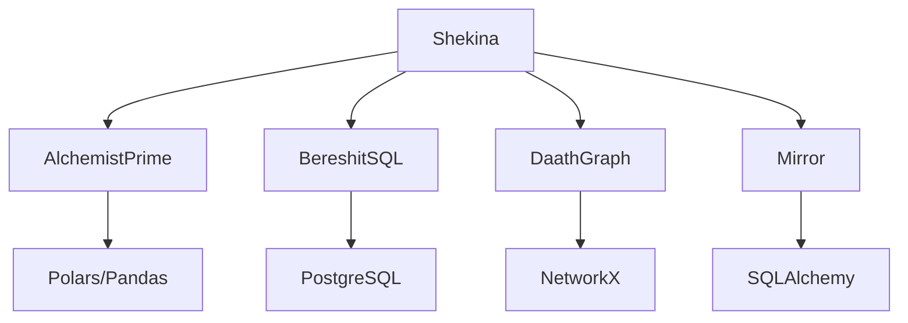

# Shekina Health Framework

Framework modular y profesional para ETL, grafos de conocimiento y orquestación avanzada en Python, con integración KNIME y soporte multi-backend. El núcleo es **AlchemistPrime**, motor ETL declarativo y auditable, complementado por módulos expertos para bases de datos, grafos y manipulación avanzada de datos.

## Arquitectura y Componentes

- **AlchemistPrime**: Motor ETL declarativo, ejecución por lotes de profundidad (DAG), auditoría avanzada, conectores dinámicos (PostgreSQL, Excel, CSV).
- **BereshitSQL**: Bootstrap y gestión de bases de datos, ejecución de scripts SQL, integración con PostgreSQL.
- **DaathGraph**: Grafo de conocimiento centralizado, nodos/aristas, consultas Cypher, integración con KNIME y agentes inteligentes.
- **Mirror**: API universal para manipulación de datos entre fuentes y destinos, operaciones multi-dialecto (PostgreSQL, MySQL, MSSQL), upsert y update robustos.
- **Shekina**: Orquestador principal, integra los módulos anteriores y expone procesos expertos para KNIME.

## Diagrama General


## Ejemplo de Uso
```python
from alchemist.alchemist_prime import AlchemistPrime
alchemist = AlchemistPrime(data_df, config_df, dictionary_df)
alchemist.transmute().agregar_status_y_errores().limpiar_columnas_intermedias()
df_final = alchemist.to_pandas()
```

## Estructura
- src/: Código fuente principal
- data/: Definiciones, tablas clave, configuraciones
- docs/: Documentación interactiva (MkDocs)
- tests/: Pruebas unitarias e integración
- scripts/: Utilidades y automatización

## Instalación
Ver `environment.yml` para dependencias y entorno reproducible.

## Casos de Uso por Módulo

### AlchemistPrime
```python
from alchemist.alchemist_prime import AlchemistPrime
alchemist = AlchemistPrime(data_df, config_df, dictionary_df)
alchemist.transmute().agregar_status_y_errores().limpiar_columnas_intermedias()
df_final = alchemist.to_pandas()
```

### BereshitSQL
```python
from bereshit_sql import BereshitSQL
bereshit = BereshitSQL(db_config, sql_dir='src/bereshit/sql')
bereshit.bootstrap()
df = bereshit.fetch_dataframe("SELECT * FROM tabla")
```

### DaathGraph
```python
from daath_graph import DaathGraph
dg = DaathGraph(db_params)
dg.populate_from_data(df, nodes_config, edges_config)
result = dg.query_cypher("MATCH (n) RETURN n")
```

### Mirror
```python
from mirror import Mirror
mirror = Mirror(config)
df = mirror.read_sql("SELECT * FROM tabla")
mirror.upsert_dataframe(df, "tabla_destino", ["id"])
mirror.close()
```

### Shekina
```python
from shekina import Shekina
shek = Shekina(config, process_table)
shek.run_process_key("sispro_cups_grservicios")
result = shek.query_grafo("MATCH (n) RETURN n")
```

## Integración con KNIME
El framework está diseñado para integrarse con flujos KNIME, permitiendo auditoría avanzada, análisis de calidad y recomendaciones automáticas.

## Auditoría y Análisis
Cada módulo incluye mecanismos de auditoría y profiling, facilitando el desarrollo de agentes inteligentes y la entrega de resultados confiables.

## Documentación
La documentación interactiva se encuentra en la carpeta `docs/` y puede ser consultada vía MkDocs Material.
