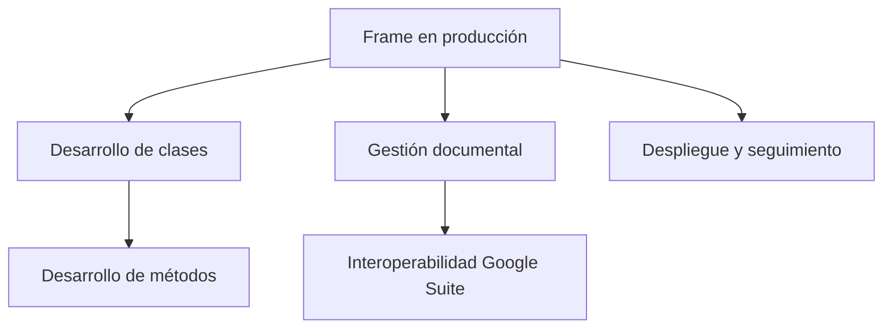

# Conceptualización del Framework Shekina

## Propósito
Este documento describe la visión, narrativa y estructura conceptual del framework Shekina, orientado a resultados y gestión ágil.

## Visión General
Shekina es un marco modular, eficiente y seguro para la gestión de datos, grafos y automatización, diseñado para ser minimalista, mantenible y multi-backend.

## Mapa Mental del Proyecto


## Cadena de Valor: rf, rit, rim
- **rf**: Resultado final (frame en producción)
- **rit**: Resultados intermedios (desarrollo de cada clase)
- **rim**: Resultados inmediatos (desarrollo de cada método o funcionalidad)

## Jerarquía de Resultados
- **Final**: Frame en producción con eficiencia, elegancia, minimalismo, seguridad y multi-backend.
- **Intermedios**: Clases principales implementadas y probadas.
- **Inmediatos**: Métodos y funcionalidades desarrolladas y validadas.

## Prompt y RIM para Diseño
Ejemplo de prompt para generación de diagrama de clase:
```
"Genera un diagrama Mermaid para la clase Aleya mostrando sus métodos principales y relaciones."
```

## Interoperabilidad y Gestión Documental
La clase `giAnt` permitirá sincronizar documentos Markdown de VS Code con Google Docs, Sheets y otras herramientas de Google Suite, facilitando la gestión documental y la colaboración ágil.

---

> Este documento se actualiza conforme avanza el desarrollo y la gestión del proyecto en GitHub Projects y Google Suite.
