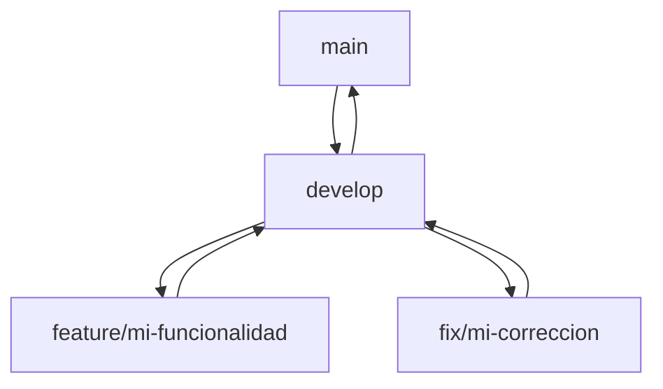

# Flujo de trabajo de ramas en Shekina

## Ramas principales
- **main**: Código estable y listo para producción. Solo se actualiza desde `develop` tras revisión y pruebas.
- **develop**: Desarrollo activo, integración de nuevas funcionalidades y pruebas. Aquí se integran los cambios antes de pasar a producción.

## Ramas de características y correcciones
- **feature/nombre-feature**: Para nuevas funcionalidades. Se crean desde `develop` y se fusionan de vuelta tras revisión.
- **fix/nombre-fix**: Para correcciones de errores. Se crean desde `develop` y se fusionan tras solucionar el problema.

## Proceso de trabajo
1. Crea una rama `feature/` o `fix/` desde `develop` para cada nueva tarea.
2. Realiza los cambios y haz commits descriptivos.
3. Haz pull requests hacia `develop` para revisión y merge.
4. Cuando `develop` esté estable y probado, haz pull request hacia `main` para liberar una nueva versión.

## Reglas y recomendaciones
- No trabajar directamente en `main` ni en `develop` (usa ramas de feature/fix).
- Los merges a `main` deben ser revisados y probados.
- Usa mensajes de commit claros y descriptivos.
- Documenta los cambios relevantes en el CHANGELOG.

## Ejemplo visual

---
Este flujo permite mantener el código organizado, seguro y colaborativo.
