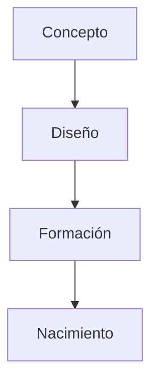

# Concepto

Bienvenido a la sección de Concepto. Aquí se documentan los fundamentos y la visión del proyecto Shekina.

Puedes agregar diagramas Mermaid usando:

```mermaid
graph TD;
    A[Concepto] --> B[Diseño];
    B --> C[Formación];
    C --> D[Nacimiento];
```
