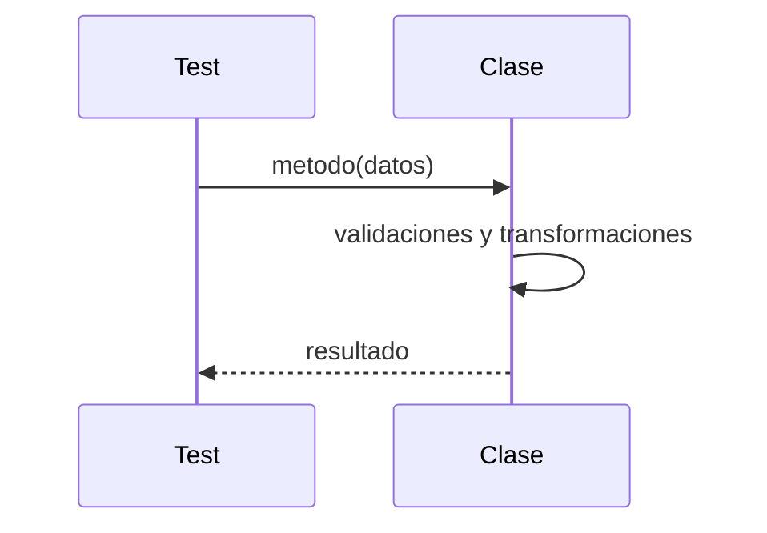
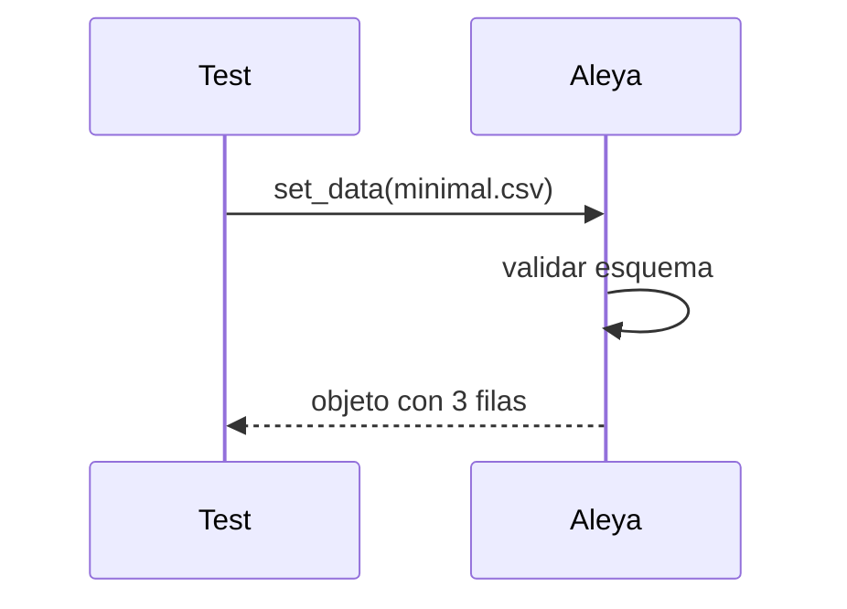

# Prompt para documentar y ejecutar pruebas por clase

Este prompt define cómo crear la narrativa de prueba, la tabla de casos, los datos y scripts, y cómo ejecutarlos en VS Code o KNIME. El objetivo es que cada método tenga pruebas unitarias autocontenidas y reproducibles.

## 0) Ubicación y estructura de pruebas (por clase)

- Documentación: `docusaurus/docs/diseño/<Clase>/tests/index.md`
- Datos de prueba: `data/test/<Clase>/...`
- Scripts de prueba (pytest): `tests/<Clase>/test_<clase>_<metodo>_<escenario>.py`

Sigue esta convención para nombres y rutas y enlaza todo desde el `index.md` de la clase.

## 1) Narrativa de la prueba en index.md
En `docusaurus/docs/diseño/<Clase>/tests/index.md` incluye:
- Breve objetivo de las pruebas de la clase y alcance.
- Supuestos y precondiciones (datos mínimos, mocks, variables).
- Reglas de éxito/fallo.

## 2) Tabla de pruebas (catálogo)
En `diseño/<Clase>/index.md` crea una tabla con estas columnas:

| test_id | test | inputs | results | VS Code | KNIME |
|--------:|------|--------|---------|---------|-------|
| Aleya/test/prueba1 | Carga configuración por defecto | data/test/Aleya/config_default.json | Config válida sin errores | [ver](tests/prueba1.md#vscode) | [ver](tests/prueba1.md#knime) |
| Aleya/test/prueba2 | Carga datos mínimos | data/test/Aleya/minimal.csv | 3 filas, 2 columnas | [ver](tests/prueba2.md#vscode) | [ver](tests/prueba2.md#knime) |

Reglas:
- `test_id`: Usa `<Clase>/<tipo>/<nombre>` (p.ej., `Aleya/test/prueba3`).
- `test`: Descripción breve del caso con nombre claro y único.
- `inputs`: Rutas a archivos dentro de `data/test/<Clase>/` o parámetros sintéticos.
- `results`: Resultado esperado resumido (valores clave, tamaño, excepción esperada).
- `VS Code` y `KNIME`: enlaces a secciones de la página de detalle del test.

## 3) Datos de prueba
- Ubica todos los datos en `data/test/<Clase>/` (CSV/JSON/Parquet… según convenga).
- Documenta en el `index.md` cómo se cargan (pandas.read_csv, etc.).
- Mantén conjuntos pequeños y deterministas. Evita accesos a red; si hace falta, mockea.

## 4) Scripts unitarios por método (pytest)
- Un archivo por método/escenario: `tests/<Clase>/test_<clase>_<metodo>_<esc>.py`.
- Estructura sugerida por caso:
   - Arrange: carga datos/fixtures locales.
   - Act: invoca el método bajo prueba.
   - Assert: valida resultado esperado (valores, tamaños, excepciones).
- Usa fixtures reutilizables en `tests/conftest.py` cuando corresponda.
- Evita dependencias externas (DB/red); usa mocks (unittest.mock/pytest-mock).

## 5) Diagramas por prueba (secuencia y flujo)
En cada página de detalle del test (por ejemplo `diseño/<Clase>/tests/prueba1.md`) incluye:
- Un diagrama de secuencia `sequenceDiagram` (interacción Test↔Clase).
- Un diagrama de flujo `flowchart` que muestre pasos de datos/validaciones y decisiones.

Nota importante (Mermaid flowchart):
- Si el texto del nodo contiene paréntesis u otros caracteres especiales, encierra el título entre comillas dobles.
   - Correcto: `B --> C["Llamar set_config(cfg)"]`
   - Incorrecto: `B --> C[Llamar set_config(cfg)]` (no será reconocido)
   - Recomendación: ante dudas, usa comillas para evitar errores de parseo.



## 6) Configuración del ambiente y ejecución (VS Code)
- Instala dependencias del proyecto y pytest.
- En Windows cmd:

```
python -m venv .venv
.venv\Scripts\activate
pip install -e .
pip install pytest
pytest -q tests/<Clase>
```

- Recomendado: tasks en VS Code o el Test Explorer de Python para ejecutar por archivo o por test.

## 7) Ejecución desde KNIME (orquestador)
Estrategias compatibles:
- Invocar funciones de la clase desde nodos Python en KNIME y validar salidas (tests funcionales ligeros).
- Ejecutar pytest desde KNIME como proceso externo (External Tool / Python Script) y capturar el reporte (por ejemplo, `pytest -q tests/<Clase>`).
- Parametrizar rutas con Flow Variables (apuntar a `data/test/<Clase>`), mantener el entorno Python alineado con el del repo.
- Buenas prácticas: aislar IO, usar entradas/salidas tabulares o JSON, registrar logs y métricas en nodos de salida.

## 8) Checklist de prueba (por clase)
- [ ] Todos los métodos públicos tienen al menos 1 prueba de éxito y 1 de borde.
- [ ] Datos de prueba locales, pequeños y deterministas.
- [ ] Sin dependencias a red/DB (mock o dataset local).
- [ ] Tabla de pruebas completa con `test_id`, `inputs`, `results`, `link`.
- [ ] Diagrama de secuencia para el caso principal.
- [ ] Comandos de ejecución documentados (VS Code/KNIME).

---

## Ejemplo (Aleya)

Ubicación: `docusaurus/docs/diseño/Aleya/tests/index.md`

Tabla:

| test_id | test | inputs | results | link |
|--------:|------|--------|---------|------|
| Aleya/test/prueba1 | Carga config por defecto | data/test/Aleya/config_default.json | Config válida sin errores | tests/Aleya/test_aleya_config_default.py |
| Aleya/test/prueba2 | Carga datos mínimos | data/test/Aleya/minimal.csv | 3 filas, 2 columnas | tests/Aleya/test_aleya_load_minimal.py |

Secuencia (prueba2):



Ejecución:

```
pytest -q tests/Aleya
```
```markdown
# Prompt para Documentar Pruebas de Clases

Genera la documentación de pruebas para cada clase Python del sistema, siguiendo estas instrucciones:

1. **Estudio de la Clase:**
   - Analiza la clase y sus métodos/atributos principales.
   - Identifica los casos de éxito relevantes para cada método y atributo.

2. **Tabla de Casos de Prueba:**
   - Crea una tabla con los siguientes campos:
     | Caso de Uso | Método/Atributo | Descripción | Datos de Entrada | Resultado Esperado |
   - Incluye todos los métodos y atributos relevantes.

3. **Datos de Prueba:**
   - Los datos de prueba deben estar en `data/test/`.
   - Indica el archivo de datos (ej: `prueba.txt`, `prueba.csv`, etc.) o describe la tabla de datos utilizada.
   - Explica cómo se cargan los datos en la prueba.

4. **Diagrama de Secuencia de la Prueba:**
   - Incluye un diagrama Mermaid (`sequenceDiagram`) que muestre cómo se transforman los datos y cómo interactúan los métodos durante la prueba.
   - Ejemplo:
     ```mermaid
     sequenceDiagram
     participant Test
     participant Clase
     Test->>Clase: método_principal(datos)
     Clase->>Clase: transformación interna
     Clase->>Test: resultado
     ```

5. **Configuración del Ambiente de Pruebas:**
   - Describe los pasos para configurar el ambiente de pruebas:
     - Instalación de dependencias.
     - Variables de entorno necesarias.
     - Ejecución de los tests.
     - Ubicación de los archivos de prueba y resultados.
   - Ejemplo:
     ```bash
     pip install -r requirements.txt
     export ENV=testing
     pytest tests/test_clase.py
     ```

6. **Documentación Modular:**
   - La documentación de la prueba debe guardarse en la carpeta de la clase bajo `tests/` (ej: `diseño/Clase/tests/index.md`).
   - Debe ser clara, modular y fácil de navegar.

7. **Checklist de Prueba:**
   - Incluye una checklist para verificar que todos los casos de uso y configuraciones han sido documentados y probados.

---

**Ejemplo de estructura para una clase:**

- Tabla de casos de prueba
- Datos de prueba y cómo se cargan
- Diagrama de secuencia
- Configuración del ambiente
- Checklist

```
