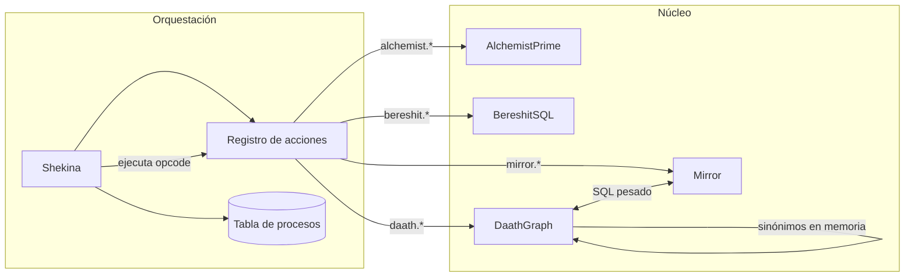

Objetivo

- Consolidar Shekina v2.0.0 como orquestador reproducible (VS Code y KNIME) sobre un núcleo con ejecución por lotes/DAG, tabla de procesos canónica, registro de acciones enchufable y responsabilidades claras entre módulos: AlchemistPrime (transformaciones), Mirror (I/O/SQL), BereshitSQL (ambientes), DaathGraph (grafos). 

Alcance y entregables

- Diseño ejecutable (código + docs) del modelo híbrido DaathGraph/Mirror.
- Tabla de procesos v0.1 con contrato estable y validación.
- Registro de acciones minimalista y extensible.
- Guías y pruebas por clase (pytest y KNIME) con datasets mínimos.
- Docusaurus actualizado con diagramas Mermaid (sin interactividad) y tablas VS Code/KNIME.

Decisión clave: DaathGraph híbrido con Mirror

- Principio: operar grafos grandes en PostgreSQL para eficiencia; reservar memoria local para relaciones “ligeras” o específicas.
- Regla de partición de relaciones:
  - Relaciones pesadas y jerárquicas (por ejemplo pertenece_a: cie -> capitulo_cie): persistidas y consultadas en PostgreSQL.
  - Relaciones de equivalencia/sinonimia (por ejemplo es_sinonimo_de): materializadas en memoria (componentes/union-find) y sincronizadas opcionalmente a BD como tablas auxiliares.
- Contrato de colaboración:
  - Mirror: dueño de conexiones y transacciones; ejecuta SQL/CTE, upsert/update/bulk y gestiona dialéctos. Expone run_sql(query, params), select_df(query), upsert_df(df, table, keys).
  - DaathGraph: dueño del modelo de grafo y de los esquemas de tablas gráficas (p.ej., graph_nodes, graph_edges, graph_synonyms). No abre conexiones directas; llama a Mirror. Expone API híbrida:
    - sync_from_pg(source: GraphSourceCfg) -> None: usa Mirror.select_df para traer nodos/aristas pesadas.
    - materialize_synonyms(df|rules) -> None: construye componentes en memoria (undirected, union-find) y opcionalmente persiste con Mirror.upsert_df a graph_synonyms.
    - query_pg(query|cypher, params) -> DataFrame: delega en Mirror.run_sql (o AGE/Cypher vía SQL).
    - export_to_pg(target: GraphSinkCfg) -> None: persiste subgrafos/atributos vía Mirror.
- Beneficios: 
  - Evita duplicación de lógica SQL y reutiliza la capa transaccional de Mirror.
  - Permite optimizar jerarquías y joins en el motor SQL y mantener equivalencias rápidas en memoria.

Arquitectura objetivo (resumen)

- Shekina: orquestador y generador/ejecutor de notebooks; coordina tabla de procesos; invoca acciones por registro; expone CLI.
- AlchemistPrime: motor batch/DAG columnar (Polars) con with_columns por capa y joins fuera de batch.
- Mirror: I/O transaccional multi-dialecto (PostgreSQL base); DML a tablas; ejecución SQL/CTE.
- BereshitSQL: gestión de ambientes (credenciales, factories, DSNs); sin DML ni lógica de procesos.
- DaathGraph: grafo híbrido; API para sincronizar, consultar (pg) y resolver sinónimos (memoria).

Tabla de procesos canónica v0.1

- Campos mínimos:
  - id (uuid), step (string), depends_on (`array<string>`), enabled (bool), when (jsonlogic expr | null),
  - opcode (string: namespace.action), payload (json), inputs (`array<string>`), outputs (`array<string>`),
  - batch (int | null), tags (`array<string>`), retries (int), timeout_s (int | null).
- Reglas:
  - Ejecución por lotes respetando depends_on; lotes paralelos; reintentos por step.
  - Validación payload con pydantic/jsonschema por opcode.

Registro de acciones (mínimo viable)

- Interfaz: register(namespace: str, name: str, fn: Callable), resolve(opcode: str) -> Callable, list() -> [opcodes].
- Convención opcodes: 
  - alchemist.transmute, mirror.upsert_dataframe, mirror.run_sql, bereshit.bootstrap_env,
  - daath.sync_from_pg, daath.materialize_synonyms, daath.export_to_pg, shekina.render_notebook.

Contratos por clase (I/O)

- Shekina
  - input: process_table (DataFrame|list[dict]), registry, context (env, paths), flags (dry_run, execute).
  - output: run_log (df), artifacts (paths), notebooks ejecutados.
- AlchemistPrime
  - input: df base(s), config columnar (steps), resources (UDFs), joins spec.
  - output: df resultante(s) por batch y final.
- Mirror
  - input: df/records, table/meta, keys, sql/params, engine/conn.
  - output: filas afectadas, DataFrame resultante.
- BereshitSQL
  - input: config de ambientes (DSN, creds, schema).
  - output: objetos de conexión/engine/Session y secrets resueltas.
- DaathGraph
  - input: cfg de fuentes (tablas/sql), df de sinónimos o reglas, filtros de subgrafo.
  - output: grafos/materializaciones en memoria, vistas/tablas persistidas en pg, métricas de conectividad.

Regla Mermaid

- En flowchart, si un nodo incluye paréntesis, su título debe ir entre comillas dobles para evitar errores de parseo. Ejemplo correcto: "Mapear (CIE)" --> A.

Diagrama de alto nivel



Plan de refactor (10 puntos)

1) Adoptar AlchemistPrime como motor batch/DAG: aislar with_columns por capas; joins fuera del batch; documentar contrato.
2) Definir y versionar la tabla de procesos v0.1: esquema, validación pydantic, ejecución condicional (jsonlogic/simpleeval).
3) Implementar registro de acciones minimalista: alta/baja/listado; mapping opcode -> callable; pruebas unitarias.
4) Reencuadrar Shekina como orquestador/notebook runner: generar y ejecutar notebooks desde la tabla de procesos; flags dry_run/execute.
5) Consolidar Mirror como capa transaccional única: run_sql/select_df/upsert_df; manejo de transacciones y errores.
6) Restringir BereshitSQL a ambientes: crear/inyectar engines/conns; remover DML; smoke tests.
7) Modelar DaathGraph híbrido con Mirror: sincronización pg, sinónimos en memoria, exportaciones; pruebas (pg mock/flags) y datasets.
8) Esbozar backend SQL de Alchemist: plan por CTE por batch para PostgreSQL; mantener modo Polars como referencia.
9) Estandarizar documentación Docusaurus: tablas VS Code/KNIME, Mermaid estático y regla de comillas; páginas por caso de uso.
10) Pruebas y entorno: pytest por clase, guías KNIME con snippets, datasets mínimos, conda + ipykernel; checklist de calidad/CI.

Detalles ampliados — AlchemistCore-SQL (in‑database)

- Objetivo: replicar el patrón de AlchemistPrime (with_columns por lote) dentro de PostgreSQL con CTEs por lote y una sola pasada por capa del DAG.
- Construcción por lotes (ejemplo esquemático):
  - Lote 0 (expresiones independientes):
    WITH t0 AS (
      SELECT base.*, 
             /* expr_1 */ ... AS col1,
             /* expr_2 */ ... AS col2
      FROM base
      /* LEFT JOINs de catálogos si el lote lo requiere */
    )
  - Lote 1 (depende de t0):
    , t1 AS (
      SELECT t0.*,
             /* expr_3 */ ... AS col3
      FROM t0
      /* JOINs adicionales si aplica */
    )
  - SELECT final: SELECT * FROM t1;  -- o más lotes según DAG
- Mapeo de step_types a SQL (PG):
  - CLEAN_TEXTO_NLP: lower, regexp_replace, unaccent (si disponible), trim.
  - CLEAN_IDENTIFIER: regexp_replace para espacios y puntuación; lower.
  - CLEAN_ID_NUMERICO: regexp_replace('[^0-9]', '', col).
  - DATETIME_BUILDER: to_timestamp(concat(col_fecha, ' ', col_hora), 'YYYY-MM-DD HH24:MI:SS').
  - ASSIGN_CONSTANT: CAST(:const AS tipo) AS target.
  - HOMOLOGATE: LEFT JOIN catálogo + COALESCE(map.col, src.col) o CASE WHEN.
  - ENRICH_WITH_JOIN: LEFT JOIN con selección controlada y rename.
- Joins: fuera del batch si cruzan capas; dentro del CTE del lote si no rompen independencia.
- Materialización: 
  - SELECT final → Mirror.upsert_df/INSERT a destino (tabla temporal o definitiva).
  - Opcional: persistir tN como vista materializada si conviene (y refrescar).
- Portabilidad: empezar por PostgreSQL; encapsular builders para MySQL/MSSQL.
- Paridad: golden tests Polars vs SQL para columnas clave; fallback a Polars si no hay equivalencia.

Detalles ampliados — Mirror (eficiencia de lectura para DaathGraph)

- Objetivo: minimizar IO y latencias cuando DaathGraph sincroniza grafos grandes desde PostgreSQL.
- Estrategias:
  - Proyecciones mínimas: SELECT solo columnas necesarias (ids, type, weight...).
  - Filtros y particiones: WHERE por type (p.ej., pertenece_a), por fechas o por recortes de subgrafo.
  - Chunks/paginación: iterar por window (OFFSET/LIMIT o keyset pagination) solo si imprescindible; preferir extracción por lotes naturales (por type).
  - Índices y hints: asegurar índices en (src, dst, type); en PG, usar EXPLAIN para validar planes.
  - CTEs dirigidos: precalcular subconjuntos con WITH y unirlos en una sola pasada cuando aplica.
  - Formatos eficientes: cuando corresponda, COPY TO STDOUT/CSV → pandas/pyarrow; o usar COPY vía conectores.
- Transacciones y consistencia:
  - Lecturas grandes en snapshot (REPEATABLE READ) si el caso exige consistencia fuerte.
  - Escrituras (upsert de sinónimos o materializaciones) en transacciones cortas y por lotes.
- API práctica en Mirror:
  - select_df(sql, params=None, chunksize=None)
  - run_sql(sql, params=None)
  - upsert_df(df, table, keys, schema=None, method='merge')

Modelo de datos sugerido (PG) para grafos

- graph_nodes(id, label, props jsonb, ts timestamptz)
- graph_edges(src, dst, type, weight numeric, props jsonb, ts timestamptz)
- graph_synonyms(term, group_id, canonical_term, props jsonb, ts timestamptz)
- Índices: graph_edges(type), graph_edges(src, type), graph_edges(dst, type), graph_nodes(id)

Telemetría y fallbacks

- Telemetría:
  - Por step: start/end, status, rows_in/out, cols_in/out, tiempo, warnings.
  - Por lote: agregados y SQL generado (hash + preview), parámetros clave.
- Fallbacks:
  - Si un step no es portable a SQL o falla por dialecto, marcar “portable=false” → ejecutarlo en Polars con los mismos inputs/outputs.
  - Bandera “prefer_sql=true/false” por pipeline y por step.

Entregables mínimos por punto

- Código: módulos y funciones con typing, docstrings y logs. 
- Pruebas: pytest happy path + bordes; guías KNIME equivalentes.
- Docs: índice por clase, tabla de casos (VS Code/KNIME), diagramas Mermaid.

Aceptación

- Todos los opcodes del primer set funcionan end-to-end desde Shekina con dry_run y execute.
- DaathGraph sincroniza jerarquías desde PostgreSQL vía Mirror y resuelve es_sinonimo_de en memoria.
- Documentación navegable y coherente; pruebas locales pasan; guías KNIME reproducibles.

Apéndice A — Sketch de APIs híbridas (DaathGraph/Mirror)

- DaathGraph
  - sync_from_pg(cfg): usa Mirror.select_df("SELECT ...") para poblar nodos/aristas pesadas.
  - materialize_synonyms(df|rules): construye componentes/union-find; atributos group_id; opcional Mirror.upsert_df(df, 'graph_synonyms', keys=['term']).
  - export_to_pg(cfg): persiste subgrafos/propiedades agregadas.
  - query_pg(sql|cypher, params): delega en Mirror.run_sql.
- Mirror
  - run_sql(sql, params=None) -> Any
  - select_df(sql, params=None) -> DataFrame
  - upsert_df(df, table, keys, schema=None) -> int

Apéndice B — Esquema tabla de procesos (yaml ejemplo)

```yaml
- id: 7f6f... 
  step: build_graph
  depends_on: [extract_terms]
  enabled: true
  opcode: daath.sync_from_pg
  payload:
    nodes_sql: SELECT id,label FROM public.graph_nodes
    edges_sql: SELECT src,dst,type FROM public.graph_edges WHERE type='pertenece_a'
  outputs: [graph.pg]
- id: 8a21...
  step: synonyms
  depends_on: [build_graph]
  enabled: true
  opcode: daath.materialize_synonyms
  payload:
    synonyms_table: public.terminos_sinonimos
  outputs: [graph.synonyms]
```

Notas operativas

- Mantener los diagramas Mermaid sin interactividad.
- En flujos KNIME, proveer Python Script snippets equivalentes y datasets mínimos.
- Documentar errores esperables y mensajes de log claves por paso.

Integración opcional: Prefect 2 como runner de Aleya

- Sentido y alcance
  - Prefect 2 aporta orquestación de producción (retries, timeouts, caching, observabilidad, agentes/despliegues) sobre el DAG que ya compila Aleya.
  - Aleya puede exponer dos runners: LocalRunner (por defecto) y PrefectRunner (opcional). La tabla canónica y el registro de acciones no cambian.
- Mapeo tabla de procesos → Prefect
  - Un Flow por “pipeline” (archivo de procesos) con tasks por step del DAG. Las capas (lotes) se ejecutan en paralelo respetando depends_on.
  - Retries/timeouts: se leen de la canónica (retries, timeout_s) y se traducen a parámetros de @task.
  - Condiciones: condition/execute se evalúan antes de enviar el task; si false, se marca skip en el run_log.
- Manejo de datos grandes
  - Evitar pasar DataFrames por el bus de Prefect. En su lugar, cada task usa Mirror para leer/escribir desde la fuente/destino y retorna identificadores livianos (URIs, table names, row counts).
  - Resultados: opcionalmente usar Prefect Results/Blocks (S3/GCS/DB) para artefactos; Aleya mantiene un run_log consolidado.
- Despliegue y ejecución
  - Local: prefect flow run para desarrollo.
  - Producción: Deployments + Agents (por ejemplo, Docker/Kubernetes). Shekina puede generar el Flow y el DeploymentSpec a partir de la canónica.
- Telemetría
  - Prefect UI añade visibilidad a nivel de task; Aleya sigue emitiendo su telemetría por step/lote.
- Sketch de integración (resumido)
  - Aleya compila DAG → construye un Flow de Prefect con @task por opcode. Cada @task llama al callable del registro con el payload validado.
  - Ejemplo @task (pseudo):
    ```python
    @task(retries=step.retries, timeout_seconds=step.timeout_s)
    def run_step(step):
        if not step.enabled or not eval_condition(step.condition):
            return {"status": "skipped"}
        fn = registry.resolve(step.opcode)
        return fn(context, step.payload)
    ```
- Trade‑offs
  - Overhead de orquestación y dependencia extra. Ventaja: observabilidad y robustez sin reescribir el motor de ejecución propio.
  - Recomendación: activar Prefect 2 solo cuando se desee scheduling multi‑entorno/CI y observabilidad avanzada; mantener LocalRunner para pruebas rápidas y cuadernos.
