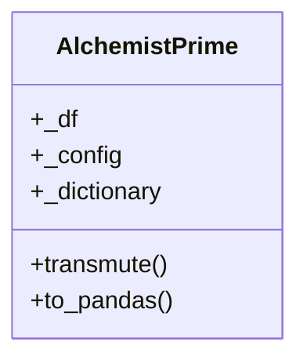
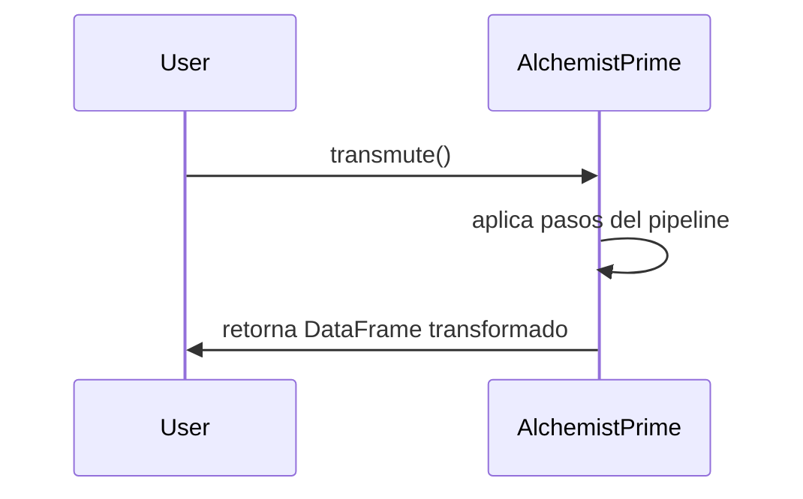

# AlchemistPrime

AlchemistPrime es la clase encargada de transformar datos tabulares mediante un pipeline configurable, permitiendo homologación y limpieza avanzada. Es fundamental para la normalización de datos en el framework.

## Diagrama de Clase



## Atributos

| Atributo      | Descripción                                         | Tipo                | Reglas / Notas                       | Métodos que lo gestionan         |
|---------------|-----------------------------------------------------|---------------------|--------------------------------------|----------------------------------|
| _df           | DataFrame interno                                   | polars.DataFrame    | Transformado por el pipeline         | constructor, transmute           |
| _config       | Configuración del pipeline                          | polars.DataFrame    | Debe estar ordenada por step_id      | constructor                      |
| _dictionary   | Diccionario de homologación                         | polars.DataFrame    | Opcional, para mapeos                | constructor                      |

## Métodos Principales

| Método         | Descripción                                      | Parámetros         | Ejemplo de uso |
|----------------|--------------------------------------------------|--------------------|---------------|
| transmute      | Ejecuta el pipeline de transformación            | -                  | `alchemist.transmute()` |
| to_pandas      | Convierte el DataFrame interno a Pandas          | -                  | `alchemist.to_pandas()` |

## Ejemplo de Uso

```python
from src.alchemist.alchemist_prime import AlchemistPrime
import pandas as pd

# Datos de entrada
data = pd.DataFrame({'nombres': ['Ana', 'Luis']})
# Configuración del pipeline
config = pd.DataFrame({
    'step_id': [1],
    'step_type': ['CLEAN_TEXTO_NLP'],
    'source_column': ['nombres'],
    'target_column': ['nombre_limpio'],
    'step_params': ['{}']
})
# Diccionario de homologación (opcional)
dictionary = pd.DataFrame({'concepto_normal': [], 'valor_normal': [], 'es_sinonimo_de': []})

# Instanciar y transformar
alchemist = AlchemistPrime(data, config, dictionary)
alchemist.transmute()  # Ejecuta el pipeline
print(alchemist.to_pandas())  # Obtiene el resultado final
```
> # Los comentarios explican cada paso clave del proceso de transformación.

## Versiones y cambios

Ver `src/alchemist/CHANGELOG_AlchemistPrime.md` para el historial de cambios.

## Diagrama de Secuencia



## Notas de diseño

- Utiliza polars para procesamiento eficiente de datos.
- El pipeline es completamente configurable por DataFrame.
- Permite integración con diccionarios externos para homologación.
- Modularidad: puede extenderse para nuevos tipos de transformación.

## Referencias cruzadas

- [Shekina](../Shekina/index.md)
- [Aleya](../Aleya/index.md)

## Checklist

- [x] ¿Incluiste el diagrama de clases y el de secuencia?
- [x] ¿Las tablas de atributos y métodos están completas y claras?
- [x] ¿El ejemplo de uso tiene comentarios explicativos?
- [x] ¿Agregaste notas de diseño y referencias cruzadas?
- [x] ¿El historial de cambios está referenciado?
- [x] ¿La navegación y los enlaces funcionan correctamente?
