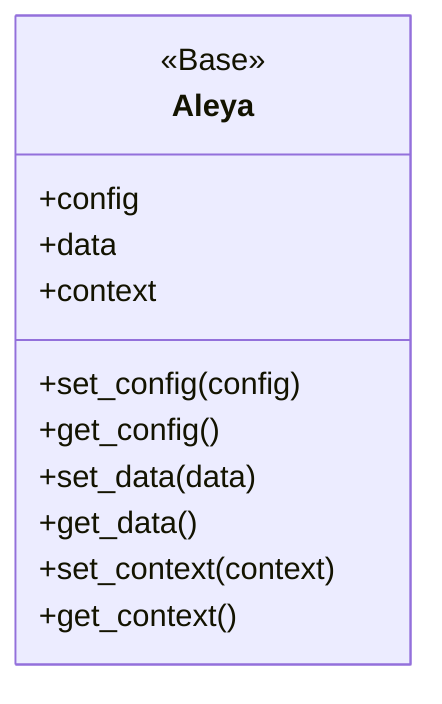
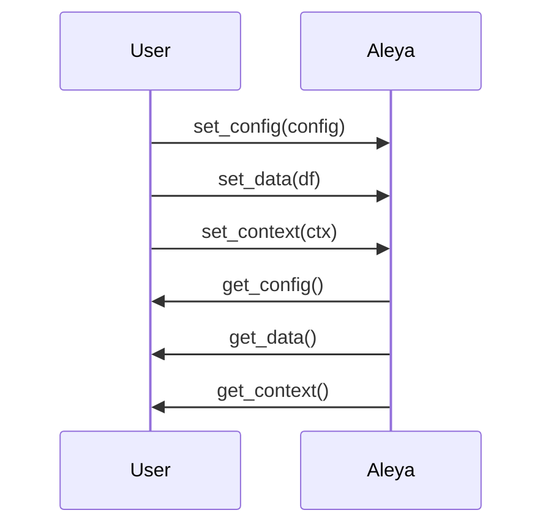

# Aleya

Aleya es una clase base para la gestión de datos y contexto en el framework, permitiendo la configuración flexible y la integración con otros módulos como DaathGraph y BereshitSQL.

## Diagrama de Clase



## Atributos

| Atributo      | Descripción                                               | Tipo         | Reglas / Notas                       | Métodos que lo gestionan         |
|---------------|-----------------------------------------------------------|--------------|--------------------------------------|----------------------------------|
| config        | Configuración general (ej. conexión, parámetros)          | dict/any     | Debe ser serializable y consistente  | set_config, get_config           |
| data          | Datos principales (ej. DataFrame de Pandas)               | any          | Debe ser compatible con operaciones  | set_data, get_data               |
| context       | Contexto extendido (ej. grafo, objeto complejo)           | any          | Opcional, puede ser None             | set_context, get_context         |

## Métodos Principales

| Método         | Descripción                                      | Parámetros         | Ejemplo de uso |
|----------------|--------------------------------------------------|--------------------|---------------|
| set_config     | Asigna el objeto de configuración                | config: dict/any   | `aleya.set_config({'db': 'postgresql'})` |
| get_config     | Obtiene el objeto de configuración actual        | -                  | `aleya.get_config()` |
| set_data       | Asigna el objeto de datos                        | data: any          | `aleya.set_data(df)` |
| get_data       | Obtiene el objeto de datos actual                | -                  | `aleya.get_data()` |
| set_context    | Asigna el objeto de contexto extendido           | context: any       | `aleya.set_context(grafo)` |
| get_context    | Obtiene el objeto de contexto actual             | -                  | `aleya.get_context()` |

## Ejemplo de Uso

```python
from src.aleya.aleya import Aleya
import pandas as pd

# Crear instancia de Aleya
aleya = Aleya()

# Configurar la conexión
aleya.set_config({'db': 'postgresql'})  # Asigna configuración
print(aleya.get_config())  # Muestra configuración actual

# Asignar datos principales
df = pd.DataFrame({'col1': [1,2]})
aleya.set_data(df)  # Asigna DataFrame
print(aleya.get_data())  # Muestra datos actuales

# Asignar contexto extendido
aleya.set_context({'user': 'admin'})  # Asigna contexto
print(aleya.get_context())  # Muestra contexto actual
```
Nota: Los comentarios explican cada paso clave de la configuración y uso de Aleya.

## Versiones y cambios

Ver `src/aleya/CHANGELOG_Aleya.md` para el historial de cambios.

## Diagrama de Secuencia



## Notas de diseño

- Clase base para integración de datos y contexto.
- Permite extensión por herencia (ej. DaathGraph, BereshitSQL).
- Facilita la serialización y compatibilidad con Pandas.

## Referencias cruzadas

- [DaathGraph](../DaathGraph/index.md)
- [BereshitSQL](../BereshitSQL/index.md)

## Pruebas Unitarias


| test_id | test | inputs | results | VS Code | KNIME |
|--------:|------|--------|---------|---------|-------|
| Aleya/test/prueba1 | Carga config por defecto | data/test/Aleya/config_default.json | Config válida sin errores | [VS Code](tests/prueba1_vscode.md) | [KNIME](tests/prueba1_knime.md) |
| Aleya/test/prueba2 | Carga datos mínimos | data/test/Aleya/minimal.csv | 3 filas, 2 columnas | [VS Code](tests/prueba2_vscode.md) | [KNIME](tests/prueba2_knime.md) |


## Checklist

- [x] ¿Incluiste el diagrama de clases y el de secuencia?
- [x] ¿Las tablas de atributos y métodos están completas y claras?
- [x] ¿El ejemplo de uso tiene comentarios explicativos?
- [x] ¿Agregaste notas de diseño y referencias cruzadas?
- [x] ¿El historial de cambios está referenciado?
- [x] ¿La navegación y los enlaces funcionan correctamente?
