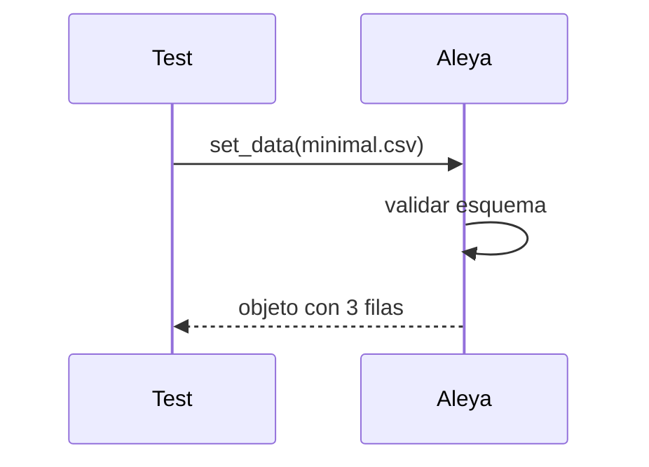

Esta sección documenta los casos de prueba unitarios para la clase Aleya.

## Narrativa
- Validar carga de configuración por defecto.
- Validar carga de datos mínimos desde CSV.
- Asegurar comportamiento determinista y sin dependencias externas.

## Catálogo de pruebas

| test_id | test | inputs | results | link |
|--------:|------|--------|---------|------|
| Aleya/test/prueba1 | Carga config por defecto | data/test/Aleya/config_default.json | Config válida sin errores | tests/Aleya/test_aleya_config_default.py |
| Aleya/test/prueba2 | Carga datos mínimos | data/test/Aleya/minimal.csv | 3 filas, 2 columnas | tests/Aleya/test_aleya_load_minimal.py |

## Secuencia (prueba2)



## Ejecución

```
pytest -q tests/Aleya
```
