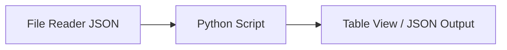

## test_id
Aleya/test/prueba1

## Objetivo
Validar la carga de configuración por defecto de Aleya dentro de un flujo KNIME.

## Inputs
- `data/test/Aleya/config_default.json`

## Flujo de trabajo (KNIME)

### Script (Python Script node)
- Cargar JSON
- `from src.aleya.aleya import Aleya`
- Instanciar y llamar `set_config(cfg)` y `get_config()`
- Emitir resultado (por ejemplo, un valor booleano o un JSON con validación)

## Pasos (KNIME)
1. Configura el entorno Python de KNIME apuntando a la misma venv del repo.
2. Arrastra nodos: File Reader (lee `config_default.json`) → Python Script → Table View.
3. Ejecuta y valida que `get_config()` sea igual al JSON leído.

## Notas
- Mantén rutas relativas o variables de flujo para portabilidad.
- Loguea resultados en el Python Script para auditoría.
