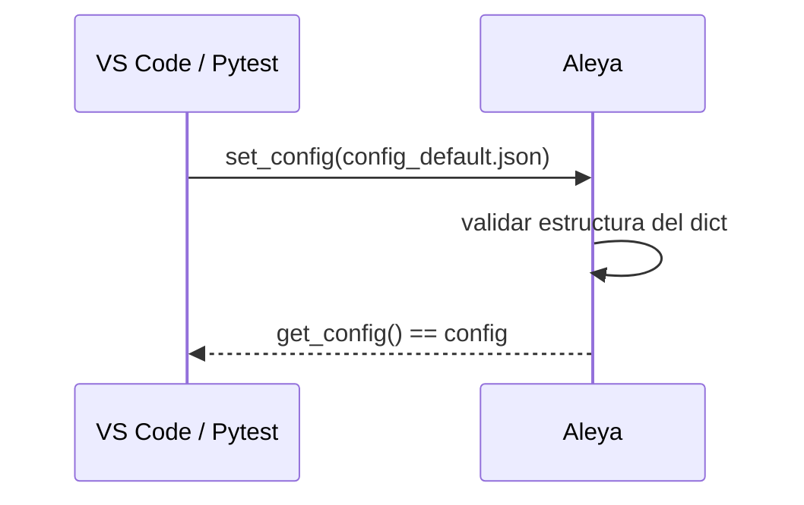
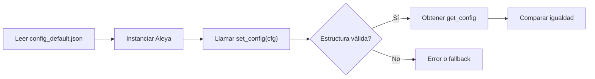

## test_id
Aleya/test/prueba1

## Objetivo
Validar que Aleya acepta una configuración por defecto y la expone correctamente.

## Inputs
- `data/test/Aleya/config_default.json`

## Ambiente (VS Code)
```
python -m venv .venv
.venv\Scripts\activate
pip install -e .
pip install pytest
```

## Ejecución (pytest)
```
pytest -q tests\Aleya\test_aleya_config_default.py::test_carga_config_por_defecto
```

## Resultado esperado
- `get_config()` devuelve el mismo diccionario cargado.

## Código de prueba (referencia)
Ruta: `tests/Aleya/test_aleya_config_default.py`

```python
from pathlib import Path
import json
from src.aleya.aleya import Aleya

DATA_DIR = Path(__file__).resolve().parents[3] / 'data' / 'test' / 'Aleya'

def test_carga_config_por_defecto():
    cfg_path = DATA_DIR / 'config_default.json'
    cfg = json.loads(cfg_path.read_text(encoding='utf-8'))
    aleya = Aleya()
    aleya.set_config(cfg)
    assert aleya.get_config() == cfg
```

## Diagrama de secuencia


## Diagrama de flujo

