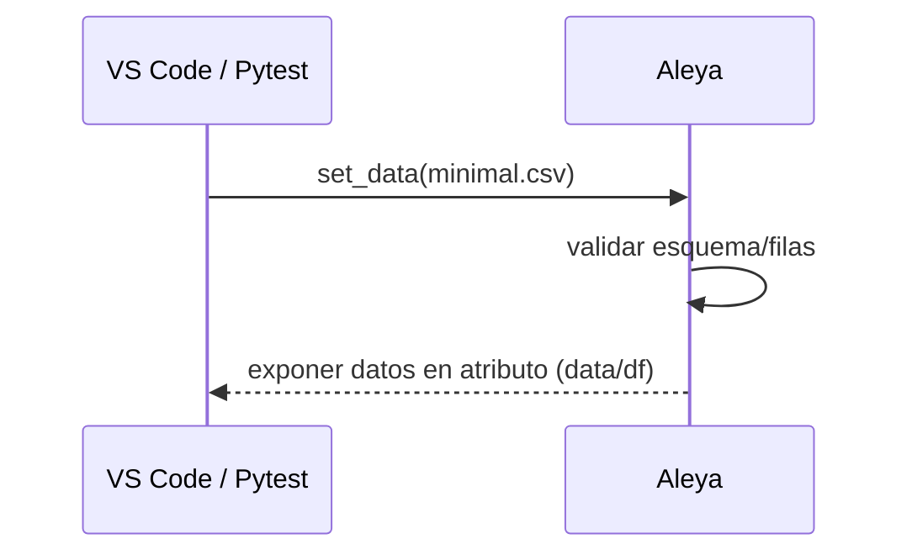
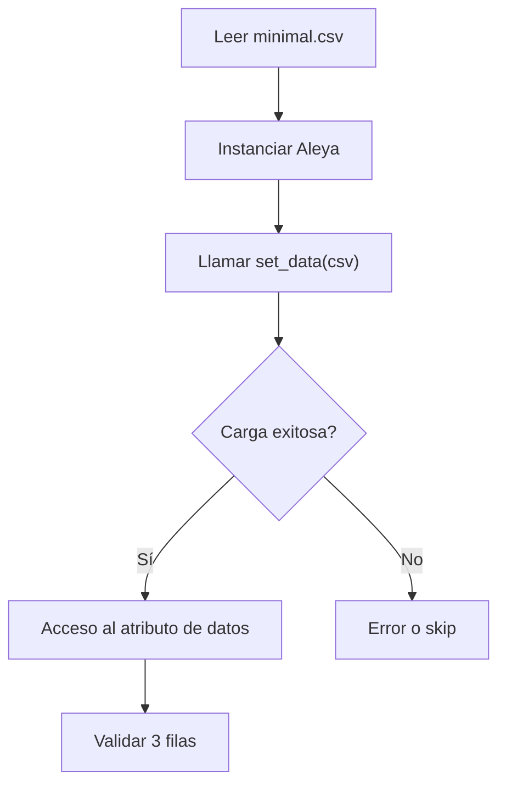

## test_id
Aleya/test/prueba2

## Objetivo
Validar que Aleya carga un dataset mínimo de 3 filas y lo deja accesible.

## Inputs
- `data/test/Aleya/minimal.csv`

## Ambiente (VS Code)
```
python -m venv .venv
.venv\Scripts\activate
pip install -e .
pip install pytest
```

## Ejecución (pytest)
```
pytest -q tests\Aleya\test_aleya_load_minimal.py::test_carga_datos_minimos
```

## Resultado esperado
- El atributo de datos accesible (`data`/`df`/`dataset`) posee 3 registros.

## Código de prueba (referencia)
Ruta: `tests/Aleya/test_aleya_load_minimal.py`

```python
from pathlib import Path
from src.aleya.aleya import Aleya

DATA_DIR = Path(__file__).resolve().parents[3] / 'data' / 'test' / 'Aleya'

def test_carga_datos_minimos():
    csv_path = DATA_DIR / 'minimal.csv'
    aleya = Aleya()
    aleya.set_data(str(csv_path))
    assert hasattr(aleya, 'data') or hasattr(aleya, 'df') or hasattr(aleya, 'dataset')
```

## Diagrama de secuencia


## Diagrama de flujo

