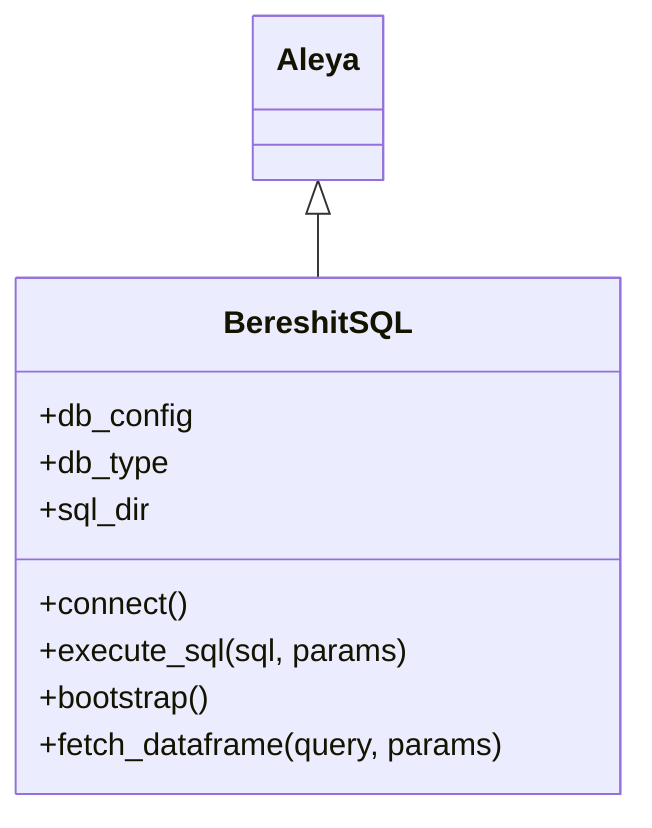
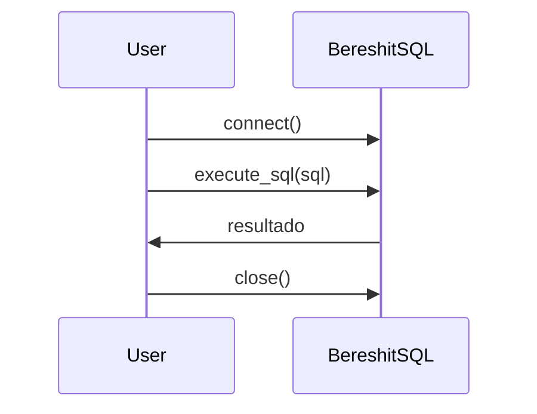

# BereshitSQL

BereshitSQL es la clase encargada de gestionar la conexión y operaciones SQL sobre la base de datos, permitiendo inicialización, ejecución de scripts y consultas eficientes. Extiende Aleya para aprovechar la gestión de contexto y configuración.

## Diagrama de Clase



## Atributos

| Atributo    | Descripción                                         | Tipo     | Reglas / Notas                       | Métodos que lo gestionan         |
|-------------|-----------------------------------------------------|----------|--------------------------------------|----------------------------------|
| db_config   | Diccionario de conexión a la base de datos          | dict     | Debe contener host, user, password   | constructor                      |
| db_type     | Tipo de base de datos                               | str      | Ej: 'postgresql', 'mysql'            | constructor                      |
| sql_dir     | Directorio de scripts SQL                           | str      | Ruta válida a scripts                | constructor                      |

## Métodos Principales

| Método           | Descripción                                      | Parámetros                | Ejemplo de uso |
|------------------|--------------------------------------------------|---------------------------|---------------|
| connect          | Establece la conexión con la base de datos        | -                         | `bereshit.connect()` |
| execute_sql      | Ejecuta una sentencia SQL                        | sql: str, params: tuple   | `bereshit.execute_sql("CREATE TABLE test (id INT)")` |
| bootstrap        | Inicializa la base de datos con scripts           | -                         | `bereshit.bootstrap()` |
| fetch_dataframe  | Ejecuta consulta y retorna DataFrame              | query: str, params: tuple | `bereshit.fetch_dataframe("SELECT * FROM tabla")` |

## Ejemplo de Uso

```python
from src.bereshit.bereshit_sql import BereshitSQL

# Configuración de la base de datos
config = {"host": "localhost", "user": "admin", "password": "pw"}

# Instanciar y conectar
bereshit = BereshitSQL(config)
bereshit.connect()  # Establece la conexión

# Ejecutar sentencia SQL
bereshit.execute_sql("CREATE TABLE test (id INT)")  # Crea tabla

# Finalizar conexión
bereshit.close()  # Cierra la conexión
```
> # Los comentarios explican cada paso clave de la gestión SQL.

## Versiones y cambios

Ver `src/bereshit/CHANGELOG_BereshitSQL.md` para el historial de cambios.

## Diagrama de Secuencia



## Notas de diseño

- Extiende Aleya para aprovechar la gestión de contexto.
- Permite inicialización automatizada de la base de datos.
- Compatible con múltiples motores SQL.
- Modularidad para scripts y consultas personalizadas.

## Referencias cruzadas

- [Aleya](../Aleya/index.md)
- [Mirror](../Mirror/index.md)

## Pruebas y casos de uso

En KNIME solemos necesitar bootstrap/control de funciones y consultas.

| test_id | Caso de uso | Entradas | Resultado | VS Code | KNIME |
|---|---|---|---|---|---|
| BereshitSQL/UC1 | Ejecutar script de bootstrap | sql_dir con scripts | Scripts ejecutados sin error | (pendiente) | [UC1 (KNIME)](./tests/uc1_knime.md) |
| BereshitSQL/UC2 | Ejecutar consulta y devolver DataFrame | query SQL | DataFrame con filas | (pendiente) | [UC2 (KNIME)](./tests/uc2_knime.md) |

## Checklist

- [x] ¿Incluiste el diagrama de clases y el de secuencia?
- [x] ¿Las tablas de atributos y métodos están completas y claras?
- [x] ¿El ejemplo de uso tiene comentarios explicativos?
- [x] ¿Agregaste notas de diseño y referencias cruzadas?
- [x] ¿El historial de cambios está referenciado?
- [x] ¿La navegación y los enlaces funcionan correctamente?
