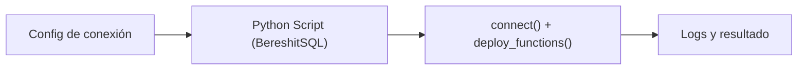

## test_id
BereshitSQL/UC1

## Objetivo
Ejecutar scripts de bootstrap (activación de extensiones/schemas/funciones) desde KNIME.

## Diagrama de flujo (KNIME)

## Resultado esperado
- Los scripts configurados se ejecutan sin errores y el `search_path` queda establecido.
