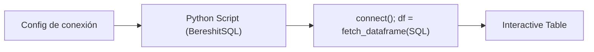

## test_id
BereshitSQL/UC2

## Objetivo
Leer datos con `fetch_dataframe(query)` desde KNIME y devolver un DataFrame.

## Diagrama de flujo (KNIME)

## Resultado esperado
- Se obtiene un DataFrame con filas y columnas esperadas.
