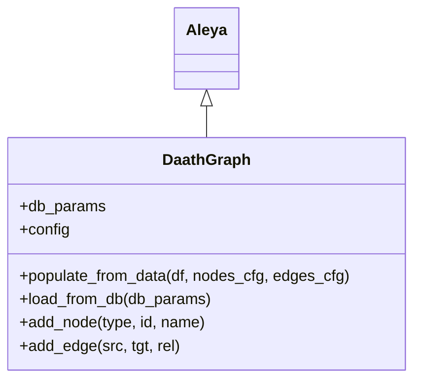
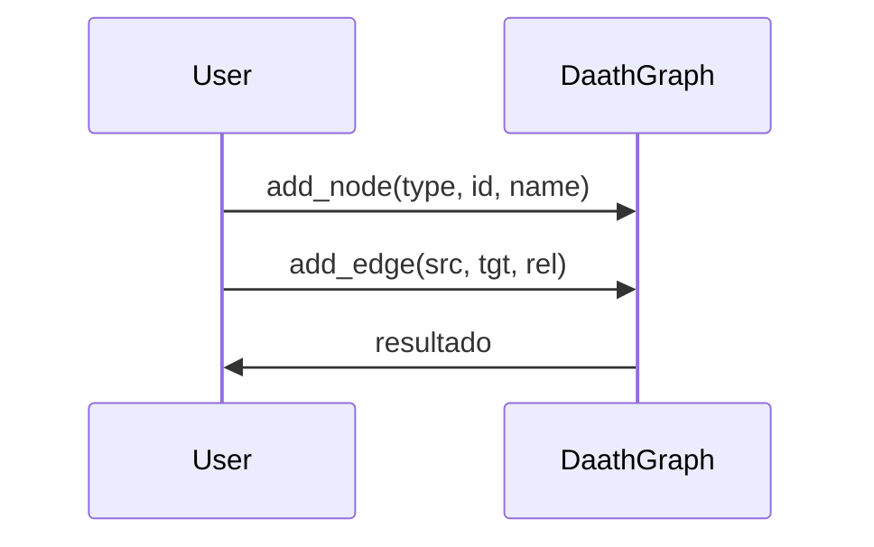

# DaathGraph

DaathGraph es la clase responsable de la gestión y modelado de grafos, permitiendo poblar nodos y relaciones desde datos tabulares o bases de datos. Extiende Aleya para aprovechar la configuración y contexto.

## Diagrama de Clase



## Atributos

| Atributo    | Descripción                                 | Tipo  | Reglas / Notas                | Métodos que lo gestionan |
|-------------|---------------------------------------------|-------|-------------------------------|--------------------------|
| db_params   | Parámetros de conexión a la base de datos   | dict  | Debe contener credenciales    | constructor              |
| config      | Configuración general                       | dict  | Opcional, puede ser None      | constructor              |

## Métodos Principales

| Método               | Descripción                                 | Parámetros                | Ejemplo de uso                                 |
|----------------------|---------------------------------------------|---------------------------|------------------------------------------------|
| populate_from_data   | Pobla el grafo desde DataFrame y configuración | df, nodes_cfg, edges_cfg  | `dg.populate_from_data(df, nodes_cfg, edges_cfg)` |
| load_from_db         | Carga el grafo desde la base de datos       | db_params: dict           | `dg.load_from_db(db_params)`                   |
| add_node             | Añade un nodo al grafo                      | type, id, name            | `dg.add_node('Paciente', 'id1', 'Juan')`       |
| add_edge             | Añade una arista/relación                   | src, tgt, rel             | `dg.add_edge('id1', 'id2', 'TIENE_DIAGNOSTICO')` |

## Ejemplo de Uso

```python
from src.daath.daath_graph import DaathGraph
import pandas as pd

# Crear instancia de DaathGraph
dg = DaathGraph()

# Añadir nodo al grafo
dg.add_node('Paciente', 'id1', 'Juan')  # Nodo tipo Paciente

# Añadir relación entre nodos
dg.add_edge('id1', 'id2', 'TIENE_DIAGNOSTICO')  # Relación entre nodos
```
> # Los comentarios explican cada paso clave de la gestión del grafo.

## Versiones y cambios

Ver `src/daath/CHANGELOG_DaathGraph.md` para el historial de cambios.

## Diagrama de Secuencia



## Notas de diseño


## Referencias cruzadas

## Pruebas y casos de uso

| test_id | Caso de uso | Entradas | Resultado | VS Code | KNIME |
|---|---|---|---|---|---|
| DaathGraph/UC1 | Actualizar grafo desde KNIME (nodes_df + edges_df) | DataFrames de nodos y aristas | Grafo contiene nodos y aristas | [UC1 (pytest)](./tests/uc1_vscode.md) | [UC1 (KNIME)](./tests/uc1_knime.md) |
| DaathGraph/UC2 | Poblar desde DataFrame + config | df + nodes/edges config | URIs consistentes y aristas creadas | (pendiente) | [UC2 (KNIME)](./tests/uc2_knime.md) |
| DaathGraph/UC3 | Consultas Cypher (AGE) | cypher query | DataFrame de resultados | (integración) | [UC3 (KNIME)](./tests/uc3_knime.md) |

## Checklist
- [x] ¿La navegación y los enlaces funcionan correctamente?
