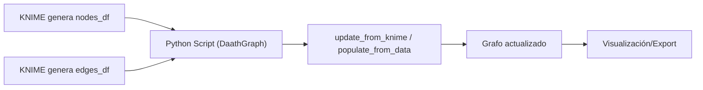

# DaathGraph · Pruebas con foco KNIME

## Casos de uso
- UC1: Actualizar grafo desde KNIME con `update_from_knime(nodes_df, edges_df)`.
- UC2: Poblar grafo desde DataFrame + config (`populate_from_data`) con construcción de URIs.
- UC3: Consultas Cypher (AGE/PostgreSQL) desde KNIME (integración).

> Regla Mermaid: en flowcharts, si hay paréntesis en el título del nodo, usar comillas dobles.

## Mapa general (flowchart)

## Pruebas
- UC1: [KNIME](./uc1_knime.md) · [pytest](./uc1_vscode.md)
- UC2: [KNIME](./uc2_knime.md) · pytest (pendiente)
- UC3: [KNIME](./uc3_knime.md) · pytest (integración)
