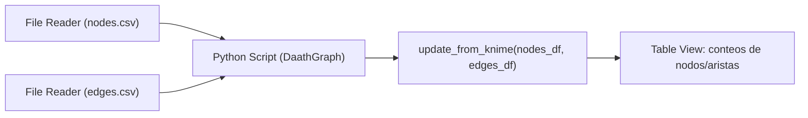

## test_id
DaathGraph/UC1

## Objetivo
Actualizar el grafo con `update_from_knime` recibiendo `nodes_df` y `edges_df` desde KNIME.

## Diagrama de flujo (KNIME)

## Pasos en KNIME
1. Leer nodos y aristas desde CSV/DB.
2. Python Script (1=>1): crear `DaathGraph()` y llamar `update_from_knime`.
3. Visualizar conteos y sample de nodos/aristas.

## Resultado esperado
- El grafo contiene los nodos y aristas provistos por los DataFrames.
