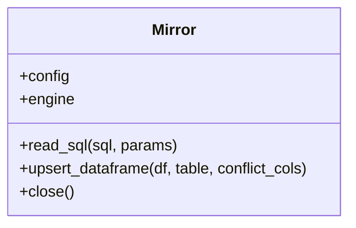
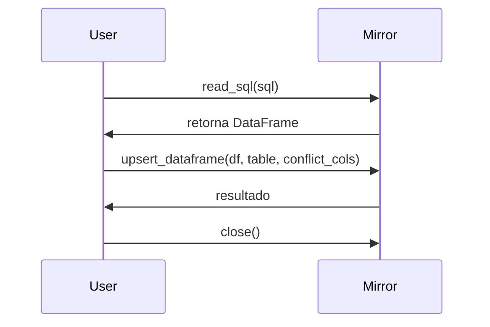

# Mirror

Mirror es la clase encargada de gestionar la conexión y operaciones con bases de datos SQL mediante SQLAlchemy, permitiendo consultas y actualizaciones eficientes de datos tabulares.

## Diagrama de Clase



## Atributos

| Atributo      | Descripción                                         | Tipo                | Reglas / Notas                       | Métodos que lo gestionan         |
|---------------|-----------------------------------------------------|---------------------|--------------------------------------|----------------------------------|
| config        | Diccionario de configuración                        | dict                | Debe contener detalles de conexión   | constructor                      |
| engine        | Motor SQLAlchemy                                    | Engine              | Pool de conexiones                   | constructor                      |

## Métodos Principales

| Método             | Descripción                                      | Parámetros                        | Ejemplo de uso |
|--------------------|--------------------------------------------------|-----------------------------------|---------------|
| read_sql           | Ejecuta consulta SQL y retorna DataFrame          | sql: str, params: dict            | `db.read_sql("SELECT * FROM tabla")` |
| upsert_dataframe   | Inserta o actualiza datos en la tabla destino     | df, table, conflict_cols          | `db.upsert_dataframe(df, 'tabla', ['id'])` |
| close              | Cierra el pool de conexiones                     | -                                 | `db.close()` |

## Ejemplo de Uso

```python
from src.mirror.mirror import Mirror
import pandas as pd

# Configuración de la base de datos
config = {
    "db_type": "postgresql",
    "host": "localhost",
    "user": "admin",
    "password": "pw",
    "database": "test"
}

# Instanciar y consultar
db = Mirror(config)
df = db.read_sql("SELECT * FROM tabla")  # Consulta datos

# Finalizar conexión
db.close()  # Cierra el pool de conexiones
```
> # Los comentarios explican cada paso clave de la gestión de la base de datos.

## Versiones y cambios

Ver `src/mirror/CHANGELOG_Mirror.md` para el historial de cambios.

## Diagrama de Secuencia



## Notas de diseño

- Utiliza SQLAlchemy para gestión eficiente de conexiones.
- Permite operaciones de lectura y escritura en tablas SQL.
- Modularidad para integración con otros componentes.

## Referencias cruzadas

- [BereshitSQL](../BereshitSQL/index.md)
- [Shekina](../Shekina/index.md)

## Pruebas y casos de uso

| test_id | Caso de uso | Entradas | Resultado | VS Code | KNIME |
|---|---|---|---|---|---|
| Mirror/UC1 | Alinear DataFrame al esquema destino | df y tabla en BD | df preparado con columnas ordenadas/limpias | (pendiente) | [UC1 (KNIME)](./tests/uc1_knime.md) |
| Mirror/UC2 | Upsert masivo con conflicto | df y tabla destino con PK | filas afectadas > 0 | (pendiente) | [UC2 (KNIME)](./tests/uc2_knime.md) |

## Checklist

- [x] ¿Incluiste el diagrama de clases y el de secuencia?
- [x] ¿Las tablas de atributos y métodos están completas y claras?
- [x] ¿El ejemplo de uso tiene comentarios explicativos?
- [x] ¿Agregaste notas de diseño y referencias cruzadas?
- [x] ¿El historial de cambios está referenciado?
- [x] ¿La navegación y los enlaces funcionan correctamente?
