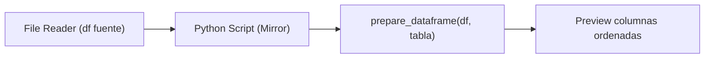

## test_id
Mirror/UC1

## Objetivo
Alinear un DataFrame al esquema de una tabla destino usando `prepare_dataframe`.

## Diagrama de flujo (KNIME)

## Resultado esperado
- El DataFrame devuelto contiene solo las columnas de la tabla, en el orden correcto, con nulos estandarizados.
