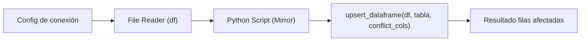

## test_id
Mirror/UC2

## Objetivo
Ejecutar un UPSERT masivo a una tabla SQL desde un DataFrame con `upsert_dataframe`.

## Diagrama de flujo (KNIME)

## Resultado esperado
- La operación completa sin errores y reporta filas afectadas (> 0 cuando aplica).
