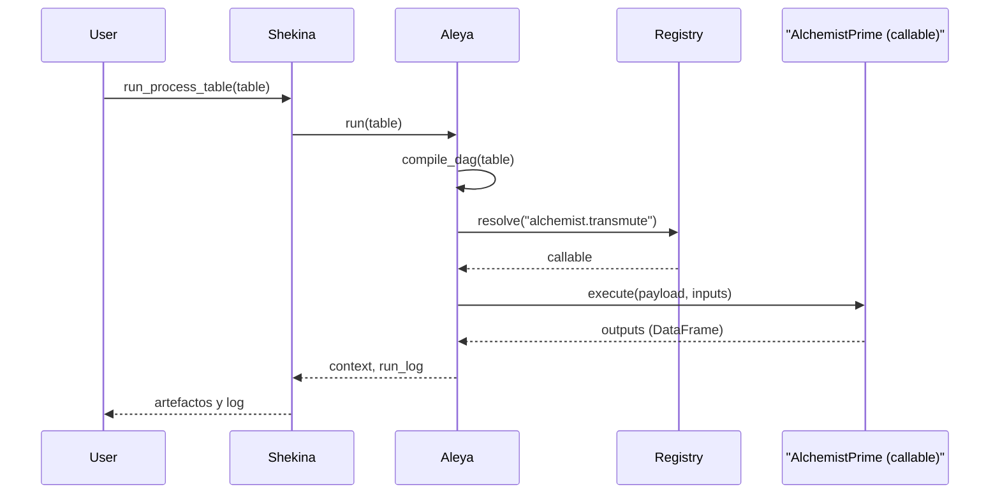

# Caso 2: Shekina → AlchemistPrime

- Qué hace: Shekina delega en Aleya la orquestación de pasos `alchemist.transmute`, y cada paso es resuelto a una función en el Registry que ejecuta transformaciones por lotes (CLEAN_IDENTIFIER, LOWERCASE, JOIN, etc.).
- Objetivo: validar que la tabla canónica define correctamente los pasos de transformación y que el Registry expone operaciones de AlchemistPrime.

## Tabla que recibe (esquema por paso)

- id: string (único)
- step: string (alias del paso)
- depends_on: string[] (ids o nombres de pasos previos)
- opcode: "alchemist.transmute"
- payload: object (p. ej., `{ op: "CLEAN_IDENTIFIER", columns: ["name"], extras... }`)
- inputs: string[] (p. ej., ["base_df"]) — opcional
- outputs: string[] (p. ej., ["clean_df"]) — opcional
- condition: object — opcional

Ejemplo de filas:

```json
[
  {
    "id": "s1",
    "step": "transmute_clean",
    "depends_on": [],
    "opcode": "alchemist.transmute",
    "payload": { "op": "CLEAN_IDENTIFIER", "columns": ["name"] },
    "inputs": ["base_df"],
    "outputs": ["clean_df"]
  },
  {
    "id": "s2",
    "step": "lowercase",
    "depends_on": ["s1"],
    "opcode": "alchemist.transmute",
    "payload": { "op": "LOWERCASE", "columns": ["name"] },
    "inputs": ["clean_df"],
    "outputs": ["lower_df"]
  }
]
```

## Diagrama de Secuencia



## Tabla que entrega

- context: artefactos nombrados en `outputs` (p. ej., `clean_df`, `lower_df`).
- run_log: lista de pasos con estado e información (step, status, info, timing).

## Notas

- Mantén los nombres de `outputs` consistentes de un paso a otro para encadenar transformaciones.
- Para operaciones compuestas (JOIN), usa `payload` con claves claras: `{ op: "JOIN", left: "df1", right: "df2", on: ["id"] }`.
