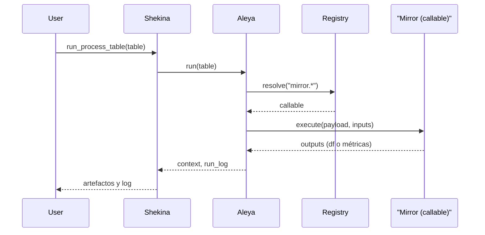

# Caso 3: Shekina → Mirror

- Qué hace: pasos de lectura/escritura usando Mirror (`mirror.select_df`, `mirror.upsert_df`, `mirror.update_from_dataframe`).
- Objetivo: validar que las operaciones de I/O se describen en la tabla y el Registry las resuelve correctamente.

## Tabla que recibe (esquema por paso)

- id, step, depends_on
- opcode: uno de `mirror.select_df`, `mirror.upsert_df`, `mirror.update_from_dataframe`
- payload: 
  - select_df: `{ sql: "SELECT ..." }` o `{ table: "name", where: "..." }`
  - upsert_df: `{ table: "name", keys: ["id"], mode?: "append|replace" }`
  - update_from_dataframe: `{ table: "name", keys: ["id"], set: ["col1", "col2"] }`
- inputs/outputs según corresponda

Ejemplo de filas:

```json
[
  { "id": "s1", "step": "lectura", "opcode": "mirror.select_df", "payload": { "sql": "SELECT id, name FROM src" }, "outputs": ["src_df"] },
  { "id": "s2", "step": "escritura", "depends_on": ["s1"], "opcode": "mirror.upsert_df", "payload": { "table": "target", "keys": ["id"] }, "inputs": ["src_df"], "outputs": ["rows_written"] }
]
```

## Diagrama de Secuencia



## Tabla que entrega

- context: `src_df`, `rows_written`, etc.
- run_log por paso.

## Notas

- Define `keys` para upsert a fin de garantizar idempotencia.
- En modo demo, se puede simular `rows_written` como el número de filas en el input.
