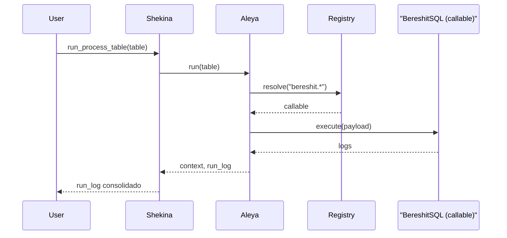

# Caso 4: Shekina → BereshitSQL

- Qué hace: pasos de inicialización/DDL con BereshitSQL (bootstrap, flags, seeds). En pruebas, ejecutar en modo dry-run.
- Objetivo: documentar y validar los contratos para inicialización del entorno.

## Tabla que recibe (esquema por paso)

- opcode: `bereshit.bootstrap` o `bereshit.exec`
- payload:
  - bootstrap: `{ flags: ["schemas", "tables", "seed?", ...], dry_run: true }`
  - exec: `{ sql: "CREATE TABLE ..." }`
- sin inputs/outputs obligatorios

Ejemplo:

```json
[
  { "id": "b1", "step": "bootstrap", "opcode": "bereshit.bootstrap", "payload": { "flags": ["schemas", "tables"], "dry_run": true } }
]
```

## Diagrama de Secuencia



## Tabla que entrega

- run_log con acciones aplicadas/omitidas.

## Notas

- Evita operaciones destructivas por defecto; usa `dry_run: true` en escenarios de prueba.
