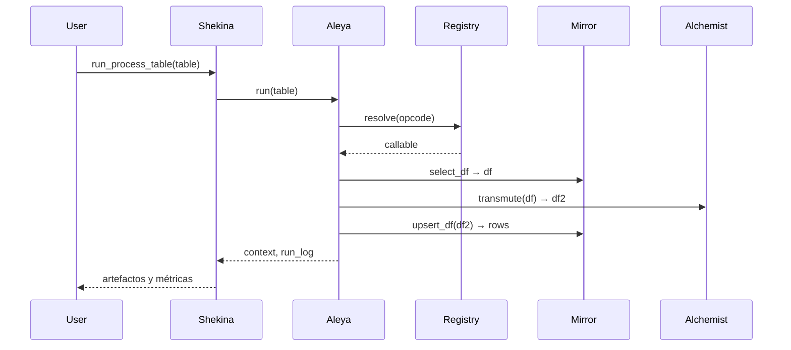

# Caso 5: Orquestación end-to-end

- Qué hace: Pipeline completo Mirror → AlchemistPrime → Mirror, con condición y paralelismo por niveles.
- Objetivo: validar el flujo E2E de lectura, transformación y escritura con artefactos intermedios.

## Tabla que recibe (resumen)

- Pasos `mirror.select_df` para lecturas
- Pasos `alchemist.transmute` para transformaciones
- Pasos `mirror.upsert_df` para escrituras
- `depends_on` para niveles y `condition` para rutas opcionales

Ejemplo sintético (resumido):

```json
[
  { "id": "s1", "step": "read", "opcode": "mirror.select_df", "payload": { "sql": "SELECT id, name FROM src" }, "outputs": ["src_df"] },
  { "id": "t1", "step": "clean", "depends_on": ["s1"], "opcode": "alchemist.transmute", "payload": { "op": "CLEAN_IDENTIFIER", "columns": ["name"] }, "inputs": ["src_df"], "outputs": ["clean_df"] },
  { "id": "w1", "step": "write", "depends_on": ["t1"], "opcode": "mirror.upsert_df", "payload": { "table": "target", "keys": ["id"] }, "inputs": ["clean_df"], "outputs": ["rows_written"] }
]
```

## Diagrama de Secuencia



## Tabla que entrega

- context con artefactos intermedios/finales (`src_df`, `clean_df`, `rows_written`)
- run_log con el detalle por paso

## Notas

- Añade `condition` para rutas opcionales y prueba un par de escenarios (condición verdadera/falsa).
