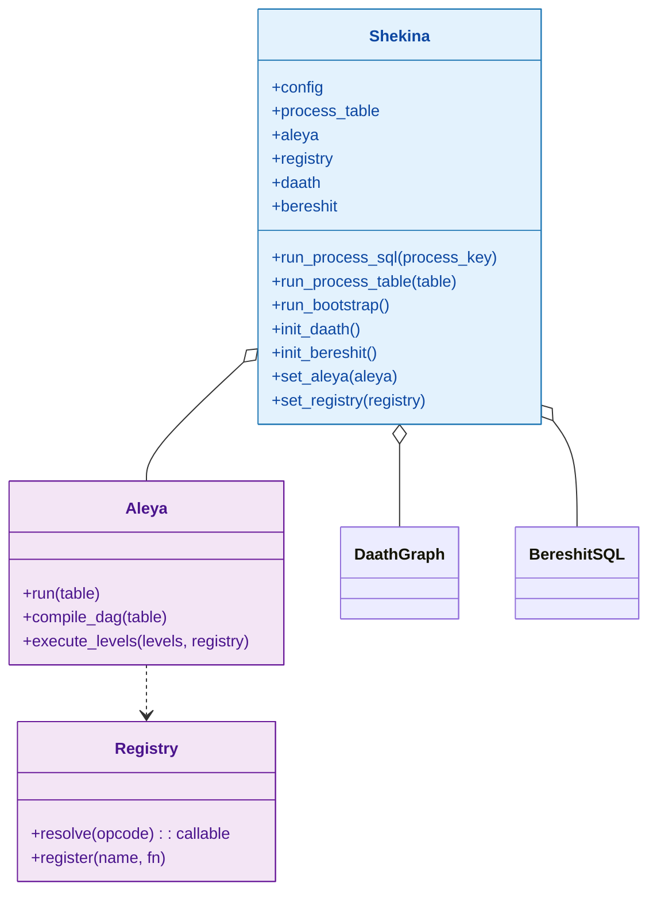
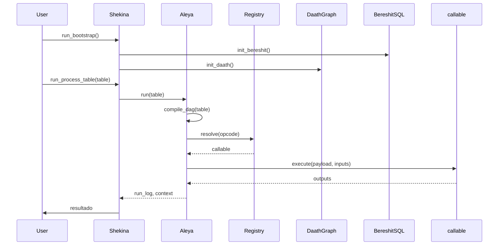
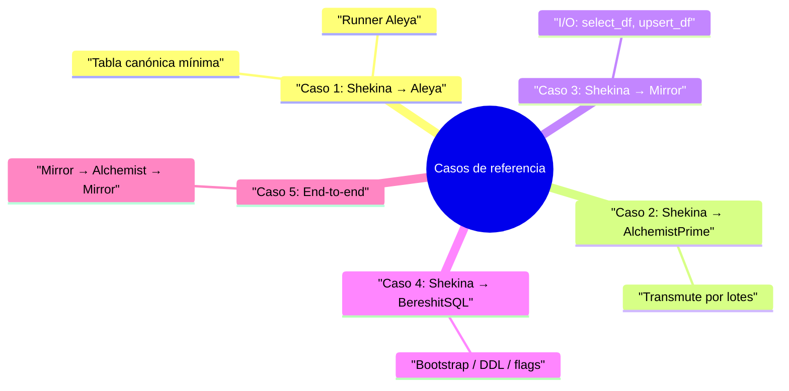
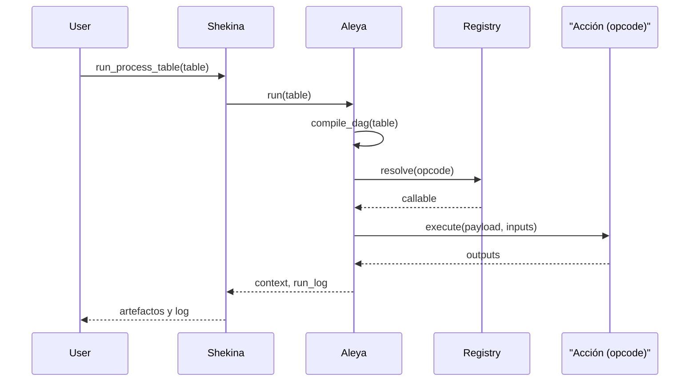

# Shekina

Shekina es la clase principal encargada de orquestar la lógica central del framework, gestionando la interacción entre los módulos y facilitando la integración de componentes. Su propósito es servir como punto de entrada y coordinación para los procesos clave del sistema.

## Diagrama de Clase

> Nota de arquitectura
>
> - Shekina es el orquestador de alto nivel: prepara contexto, valida la tabla canónica y delega la ejecución.
> - Aleya es el “runner” de procesos por lotes (DAG): resuelve paralelismo, retries/timeouts y telemetría.
> - Registry es el catálogo de acciones (opcodes → funciones) que Aleya invoca en cada paso.
>
> En el demo Jupyter simplificamos el runner y Shekina interactúa directo con el Registry para ilustrar el flujo; en producción, Shekina delega a Aleya, y Aleya usa el Registry.



## Atributos

| Atributo      | Descripción                                         | Tipo                | Reglas / Notas                       | Métodos que lo gestionan         |
|---------------|-----------------------------------------------------|---------------------|--------------------------------------|----------------------------------|
| config        | Configuración global                                | dict                | Parámetros para todos los componentes| constructor                      |
| process_table | Tabla de procesos                                   | list/DataFrame      | Define procesos y configuración      | constructor                      |
| daath         | Instancia DaathGraph                                | DaathGraph          | Inicializada por método              | init_daath                       |
| bereshit      | Instancia BereshitSQL                               | BereshitSQL         | Inicializada por método              | init_bereshit                    |

## Métodos Principales

| Método             | Descripción                                      | Parámetros                        | Ejemplo de uso |
|--------------------|--------------------------------------------------|-----------------------------------|---------------|
| run_process_table  | Ejecuta tabla canónica (delegando en Aleya)      | table: list[dict], registry?: obj | `shekina.run_process_table(table, registry)` |
| run_process_sql    | [DEPRECATED] SQL directo y poblar grafo          | process_key: str                  | `shekina.run_process_sql('proceso')` |
| run_bootstrap      | Inicializa la base de datos                      | -                                 | `shekina.run_bootstrap()` |
| init_daath         | Inicializa la instancia DaathGraph               | -                                 | `shekina.init_daath()` |
| init_bereshit      | Inicializa la instancia BereshitSQL              | -                                 | `shekina.init_bereshit()` |

## Ejemplo de Uso

```python
from src.shekina.shekina import Shekina

# Configuración global del sistema
config = {'db_params': {'host': 'localhost', 'user': 'admin', 'password': 'pw'}}

# Instanciar y bootstrap
shekina = Shekina(config)
shekina.run_bootstrap()  # Inicializa la base de datos

# Ejecutar proceso SQL
shekina.run_process_sql('proceso')  # Ejecuta proceso y pobla grafo
```
> # Los comentarios explican cada paso clave del ciclo de vida de Shekina.

## Versiones y cambios

Ver `src/shekina/CHANGELOG_Shekina.md` para el historial de cambios.

## Diagrama de Secuencia



## Casos de referencia (refactor)

Estos casos simplifican la carpeta de tests y enfocan en contratos (entradas/salidas) sin depender de KNIME. Cada caso incluye breve descripción, diagrama y tabla de I/O.



| Caso | Descripción | Insumos (tabla) | Resultados | Enlace |
|------|-------------|------------------|------------|--------|
| 1. Shekina → Aleya | 2 pasos: select + transmute, ejecutado por Aleya | id, step, depends_on, opcode, payload, inputs, outputs | context (base_df, clean_df), run_log | [Demo interactivo](./tests/notebook_demo.mdx) |
| 2. Shekina → AlchemistPrime | Transmutaciones declarativas (CLEAN_IDENTIFIER, LOWERCASE, JOIN) | steps de tipo transmute por lote | DataFrames transformados, run_log | [Ver caso 2](./casos/caso-2-alchemistprime.md) |
| 3. Shekina → Mirror | Lectura y escritura (select_df, upsert_df) | payload sql/table/keys, inputs/outputs | DataFrames leídos, rows_written, run_log | [Ver caso 3](./casos/caso-3-mirror.md) |
| 4. Shekina → BereshitSQL | Bootstrap/DDL (dry-run en pruebas) | procesos de inicialización con flags | run_log de acciones aplicadas/omitidas | [Ver caso 4](./casos/caso-4-bereshitsql.md) |
| 5. End-to-end | Pipeline Mirror→Alchemist→Mirror con condición y paralelismo | tabla canónica completa | artefactos intermedios/finales, métricas | [Ver caso 5](./casos/caso-5-e2e.md) |

### Caso 1: Shekina → Aleya (tabla de 2 pasos)

- Qué hace: ejecuta una tabla canónica mínima con 2 pasos (select y transmute) delegando en Aleya como runner.
- Tabla que recibe: id, step, depends_on, opcode, payload, inputs, outputs.
- Diagrama de Clase: Shekina o— Aleya; Aleya ..> Registry.
- Diagrama de Secuencia: Shekina run_process_table → Aleya run → Registry resolve → callable execute → context/run_log.
- Tabla que entrega: context (p. ej., base_df, clean_df), run_log (step, status, info).

Ejemplo práctico: ver “Versión completa” del cuaderno en `notebooks/Shekina/proceso_demo.ipynb` y la doc del demo interactivo.

#### Diagrama de Secuencia (Caso 1)



#### Entrada/salida (Caso 1)

| Entrada interactiva | Salida |
|---------------------|--------|
| Editor de datos en [Notebook demo](./tests/notebook_demo.mdx) y JSON de la tabla canónica (2 pasos). | context: base_df, clean_df; rows_written (si hay upsert); run_log (step, status, info). |

### Caso 2: Shekina → AlchemistPrime

- Qué hace: delega a AlchemistPrime para transmutaciones por lotes; Aleya orquesta pasos `alchemist.transmute` con steps declarativos.
- Entradas: tabla con steps de tipo transmute (CLEAN_IDENTIFIER, LOWERCASE, JOIN, etc.).
- Salidas: DataFrame(s) transformados y run_log.

### Caso 3: Shekina → Mirror

- Qué hace: usa Mirror para I/O (select_df, upsert_df, update_from_dataframe) dentro de la tabla canónica.
- Entradas: payload con `sql`/`table`/`keys`.
- Salidas: DataFrames leídos y métricas de escritura (rows_written), más run_log.

### Caso 4: Shekina → BereshitSQL

- Qué hace: bootstrap de ambientes/DDL y procesos de inicialización con flags (sin BD real en pruebas, modo dry-run).
- Entradas: tabla de procesos con step de inicialización y parámetros.
- Salidas: run_log de acciones aplicadas/omitidas.

### Caso 5: Shekina orquesta transformación completa

- Qué hace: pipeline end-to-end combinando pasos de Mirror (lectura), AlchemistPrime (transformación) y Mirror (escritura) con condiciones y paralelismo por niveles.
- Entradas: tabla canónica completa; datos de origen/target; condiciones.
- Salidas: artefactos intermedios/finales (p. ej., clean_df) y métricas de escritura.

Recursos:
- Demo interactivo de tabla canónica: [Notebook demo — orquestación](./tests/notebook_demo.mdx)
- Matriz interactiva de pruebas: [Matriz de pruebas](./tests/matrix_interactiva.mdx)

Demostración adicional (Jupyter): [Notebook demo — orquestación](./tests/notebook_demo.mdx)

Tabla interactiva: [Matriz de pruebas](./tests/matrix_interactiva.mdx)

## Notas de diseño

- Orquestador principal del framework.
- Modularidad: integra DaathGraph y BereshitSQL como componentes.
- Permite inicialización y ejecución de procesos SQL y grafo.

## Referencias cruzadas

- [DaathGraph](../DaathGraph/index.md)
- [BereshitSQL](../BereshitSQL/index.md)
- [Contratos del Registry](./registry_contracts.md)

## Checklist

- [x] ¿Incluiste el diagrama de clases y el de secuencia?
- [x] ¿Las tablas de atributos y métodos están completas y claras?
- [x] ¿El ejemplo de uso tiene comentarios explicativos?
- [x] ¿Agregaste notas de diseño y referencias cruzadas?
- [x] ¿El historial de cambios está referenciado?
- [x] ¿La navegación y los enlaces funcionan correctamente?
