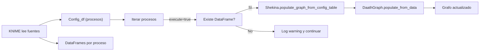

# Shekina · Pruebas con foco KNIME

Partimos de un catálogo de casos de uso. Cada prueba unitaria referencia un caso y se acompaña de dos variantes: ejecución en VS Code (pytest) y orquestación en KNIME.

## Catálogo de casos de uso

- UC1: Poblar grafo desde una tabla de configuración y un diccionario de DataFrames recibidos desde KNIME.
- UC2: Omitir procesos marcados como execute=false.
- UC3: Registrar advertencia cuando falta el DataFrame para un proceso válido.

> Regla Mermaid: en flowcharts, si el texto del nodo contiene paréntesis, enciérralo entre comillas dobles.

## Mapa general (flowchart)

## Pruebas

- UC1: [KNIME](./uc1_knime.md) · [pytest](./uc1_vscode.md)
- UC2: [KNIME](./uc2_knime.md) · pytest (pendiente)
- UC3: [KNIME](./uc3_knime.md) · pytest (pendiente)
