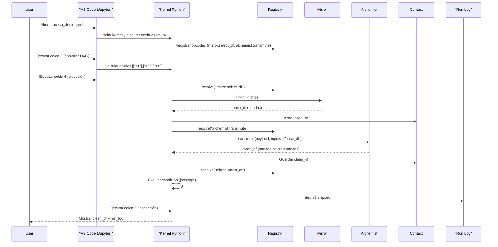
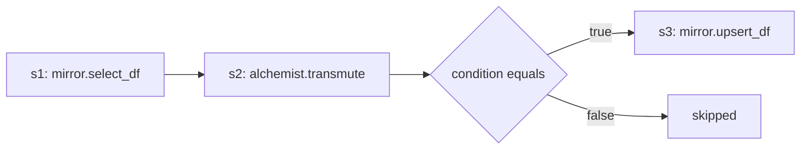

# Demo Jupyter — Orquestación con tabla canónica

Este demo muestra cómo Shekina orquesta un proceso simple desde una “tabla canónica” (JSON), ejecutando por lotes (DAG), con un paso que se omite por condición. Todo corre en memoria con pandas y un fallback opcional si no hay Polars instalado.

- Notebook: `notebooks/Shekina/proceso_demo.ipynb`
- Proceso (JSON): `notebooks/Shekina/proceso_demo.json`

Importante (Mermaid): si algún nodo incluye paréntesis, el título debe ir entre comillas dobles para evitar errores de parseo en los diagramas.

## Secuencia del cuaderno (Jupyter)

## Flujo de proceso (s1 → s2 → s3 con condición)

## Tabla de configuración (por paso)

| id  | step       | opcode                | depends_on     | enabled | condition            | inputs          | outputs             | payload (resumen) |
|-----|------------|-----------------------|----------------|---------|----------------------|-----------------|---------------------|-------------------|
| s1  | load_base  | mirror.select_df      | `[]`           | true    | —                    | —               | `['base_df']`       | `sql: "SELECT 1 AS id, 'A' AS raw UNION ALL SELECT 2, 'B'"` (espera columnas `id:int`, `raw:str`) |
| s2  | cleanup    | alchemist.transmute   | `['load_base']`| true    | —                    | `['base_df']`   | `['clean_df']`      | `engine: 'polars'` (con fallback a pandas). `steps: [{type: 'CLEAN_IDENTIFIER', src: 'raw', target: 'clean', pattern: '[^A-Za-z0-9]', replacement: ''}]` |
| s3  | skip_demo  | mirror.upsert_df      | `['cleanup']`  | true    | `{"==": [1, 2]}`    | `['clean_df']`  | `['rows_written']`  | `table: 'demo.out'`, `keys: ['id']` (se omite por condición falsa en este demo) |

Contrato de I/O esperado:

- `base_df`: DataFrame con columnas `id:int`, `raw:str`.
- `clean_df`: DataFrame con columnas `id:int`, `raw:str`, `clean:str` (resultado de `CLEAN_IDENTIFIER`).
- `rows_written`: entero con filas afectadas por `upsert_df` (en el demo no se ejecuta por condición falsa).

## Prueba interactiva (en el navegador)

Puedes experimentar con la tabla canónica sin salir del sitio. Edita el JSON y observa cómo cambian los niveles (DAG) y el diagrama Mermaid.

import NotebookPlayground from '@site/src/components/NotebookPlayground';

<NotebookPlayground />

## Cómo ejecutarlo en VS Code

1) Abre `notebooks/Shekina/proceso_demo.ipynb`.
2) Selecciona el kernel de Python de tu entorno (por ejemplo, “shekina (Python 3.9)”).
3) Ejecuta las celdas en orden:
   - Celda 1: descripción (markdown).
   - Celda 2: setup (importa pandas; Polars es opcional y hay fallback a pandas).
   - Celda 3: compila el DAG y muestra los niveles (esperado: `[["s1"],["s2"],["s3"]]`).
   - Celda 4: ejecuta los pasos por lotes; `s1` y `s2` deben ser `ok`, `s3` se marca `skipped` por condición falsa.
   - Celda 5: imprime `context` y un `run_log` en DataFrame.

Resultados esperados:

- context keys: `['base_df', 'clean_df']`
- run_log con 3 filas: `load_base (ok)`, `cleanup (ok)`, `skip_demo (skipped)`.

## Notas técnicas

- `mirror.select_df` (demo) construye un DataFrame pequeño en memoria (simula lectura por SQL); en producción lo realiza Mirror con la conexión real.
- `alchemist.transmute` aplica un CLEAN_IDENTIFIER; si Polars no está disponible, usa pandas con la misma semántica.
- La condición se evalúa con una forma mínima de jsonlogic; si es falsa, el step se salta y se registra en el run_log.
