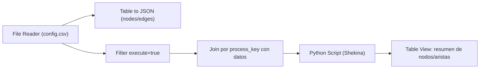
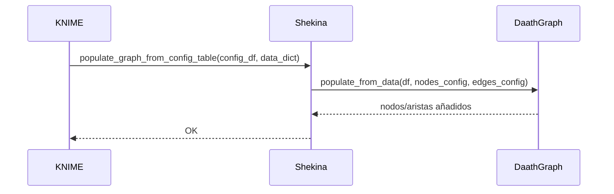

## test_id
Shekina/UC1

## Objetivo
Poblar el grafo a partir de una tabla de configuración (config_df) y un diccionario de DataFrames (data_dict) entregados por KNIME.

## Inputs
- config_df con columnas: process_key, nodes_config, edges_config, execute (bool)
- data_dict: `{process_key: DataFrame}`

## Diagrama de flujo (KNIME)


## Diagrama de secuencia


## Pasos en KNIME (sugerencia)
1. File Reader: leer config.csv y datasets por proceso.
2. JSON Path / Column Expressions: transformar columnas nodes_config/edges_config a estructuras JSON.
3. Filter: `execute == true`.
 4. Python Script (1=>1):
   - Código base:
```python
import pandas as pd
from pathlib import Path
from src.shekina.shekina import Shekina
from src.daath.daath_graph import DaathGraph

# Inputs del nodo
config_df = input_table.copy()

# Cargar datasets por proceso desde disco (ejemplo)
repo = Path('C:/shekina')
data_p1 = pd.read_csv(repo/'data/test/Shekina/data_p1.csv')
data_dict = {'p1': data_p1}

shek = Shekina({'db_params': {}})
shek.daath = DaathGraph()
shek.populate_graph_from_config_table(config_df, data_dict)

# Output: conteos básicos
g = shek.daath.graph
output_table = pd.DataFrame({
    'nodes': [g.number_of_nodes()],
    'edges': [g.number_of_edges()]
})
```
5. Table View: mostrar conteos de nodos/aristas.

## Resultado esperado
- Se crean nodos y aristas según config para cada proceso con execute=true.
- No se generan errores si algún proceso tiene DataFrame vacío: se registra warning y continúa.
