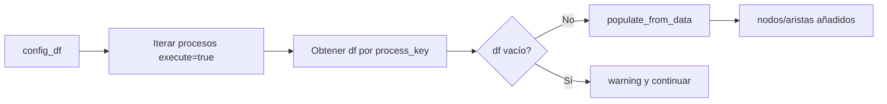

## test_id
Shekina/UC1

## Objetivo
Verificar que `populate_graph_from_config_table` crea nodos y aristas usando un config_df y un data_dict in-memory (sin DB).

## Ejecución (pytest)
```
pytest -q tests\Shekina\test_shekina_uc1.py::test_populate_graph_from_config_table
```

## Código de prueba (referencia)
Ruta: `tests/Shekina/test_shekina_uc1.py`

```python
import pandas as pd
from src.shekina.shekina import Shekina
from src.daath.daath_graph import DaathGraph


def test_populate_graph_from_config_table():
    # Config mínima
    config = { 'db_params': {'host':'localhost','user':'u','password':'p','dbname':'x'} }
    shek = Shekina(config)
    shek.daath = DaathGraph()

    # Tabla de configuración
    config_df = pd.DataFrame([
        {
            'process_key':'p1', 'execute': True,
            'nodes_config':[{'type':'CUPS','id_field':'cups','name_field':'nombre'}],
            'edges_config':[{'relationship':'PERTENECE_A','source':'cups','target':'servicio','source_type':'CUPS','target_type':'Servicio'}]
        }
    ])

    # Datos fuente
    data_df = pd.DataFrame([{'cups': '001', 'nombre':'Consulta', 'servicio':'S1'}])
    data_dict = {'p1': data_df}

    # Ejecutar
    shek.populate_graph_from_config_table(config_df, data_dict)

    # Afirmaciones básicas sobre el grafo
    g = shek.daath.graph
    assert g.number_of_nodes() >= 2
    assert g.number_of_edges() >= 1
```

## Diagrama de flujo

