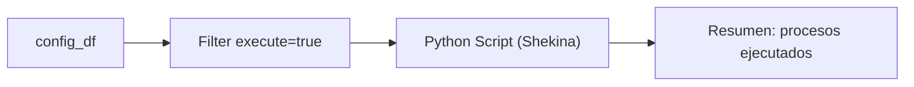

## test_id
Shekina/UC2

## Objetivo
Omitir procesos marcados con `execute=false` en la tabla de configuración.

## Diagrama de flujo (KNIME)


## Resultado esperado
- No se ejecutan procesos con execute=false y no se crean nodos/aristas para ellos.

## Python Script (ejemplo)
```python
import pandas as pd
from src.shekina.shekina import Shekina
from src.daath.daath_graph import DaathGraph

config_df = input_table.copy()
shek = Shekina({'db_params': {}})
shek.daath = DaathGraph()
shek.populate_graph_from_config_table(config_df, {})

g = shek.daath.graph
output_table = pd.DataFrame({'nodes':[g.number_of_nodes()], 'edges':[g.number_of_edges()]})
```
