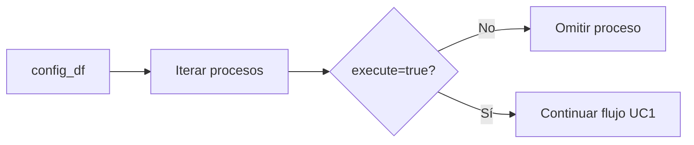

## test_id
Shekina/UC2

## Objetivo
Verificar que los procesos con `execute=false` se omiten y no crean nodos/aristas.

## Ejecución (pytest)
```
pytest -q tests\Shekina\test_shekina_uc2.py::test_skip_execute_false
```

## Diagrama de flujo

