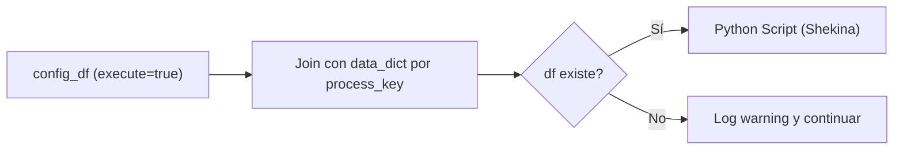

## test_id
Shekina/UC3

## Objetivo
Cuando falta el DataFrame en `data_dict` para un `process_key` válido, registrar un warning y continuar con el siguiente proceso.

## Diagrama de flujo (KNIME)


## Resultado esperado
- Se procesan los procesos con datos y se omiten los que no, registrando advertencias.

## Python Script (ejemplo)
```python
import pandas as pd
from src.shekina.shekina import Shekina
from src.daath.daath_graph import DaathGraph

config_df = input_table.copy()
shek = Shekina({'db_params': {}})
shek.daath = DaathGraph()

# No proveemos df para el process_key => generará warning
data_dict = {}
shek.populate_graph_from_config_table(config_df, data_dict)

g = shek.daath.graph
output_table = pd.DataFrame({'nodes':[g.number_of_nodes()], 'edges':[g.number_of_edges()]})
```
