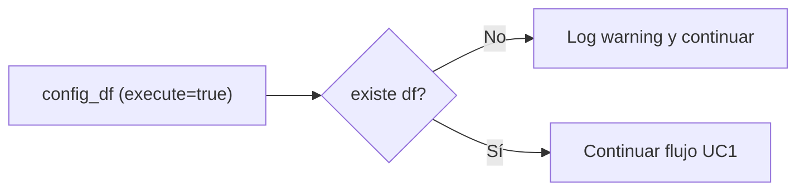

## test_id
Shekina/UC3

## Objetivo
Verificar que, cuando falta el DataFrame para un `process_key` válido, se registra un warning y el flujo continúa sin error.

## Ejecución (pytest)
```
pytest -q tests\Shekina\test_shekina_uc3.py::test_missing_dataframe_logs_warning
```

## Diagrama de flujo

