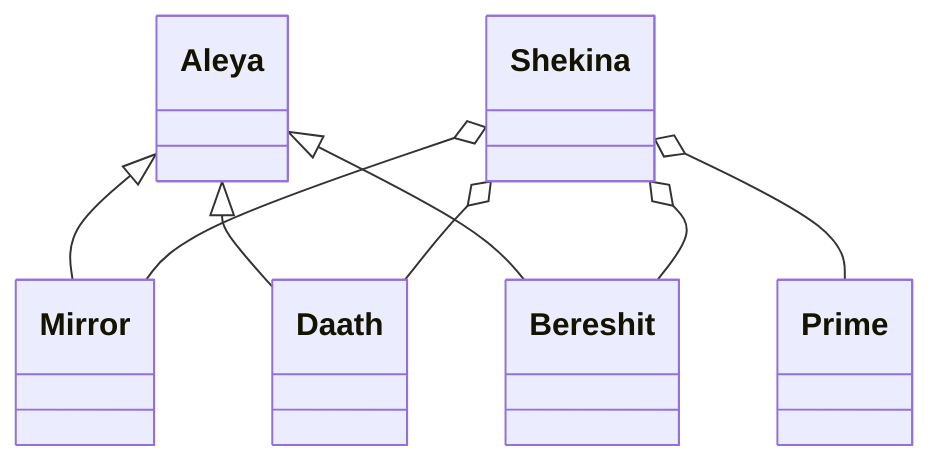

# Arquitectura del Framework Shekina

El framework está organizado en módulos independientes y minimalistas:

- **Aleya**: Clase base para gestión de contexto, configuración y datos tabulares.
- **Mirror**: Gestión de transacciones y manipulación de datos entre fuentes y destinos.
- **Daath**: Grafo de conocimiento, nodos y relaciones.
- **Bereshit**: Inicialización y operaciones SQL multi-backend.
- **Prime**: Motor experto para transformación, saneamiento y normalización avanzada.
- **Shekina**: Orquestador principal entre KNIME y el ecosistema Python/DB.

Cada módulo accede a la carpeta `data/` para definiciones, tablas clave y configuraciones centralizadas.

## Diagrama de módulos

## Principios
- Modularidad y responsabilidad única.
- Documentación y versionado por clase.
- Integración con control de versiones y CI/CD.
