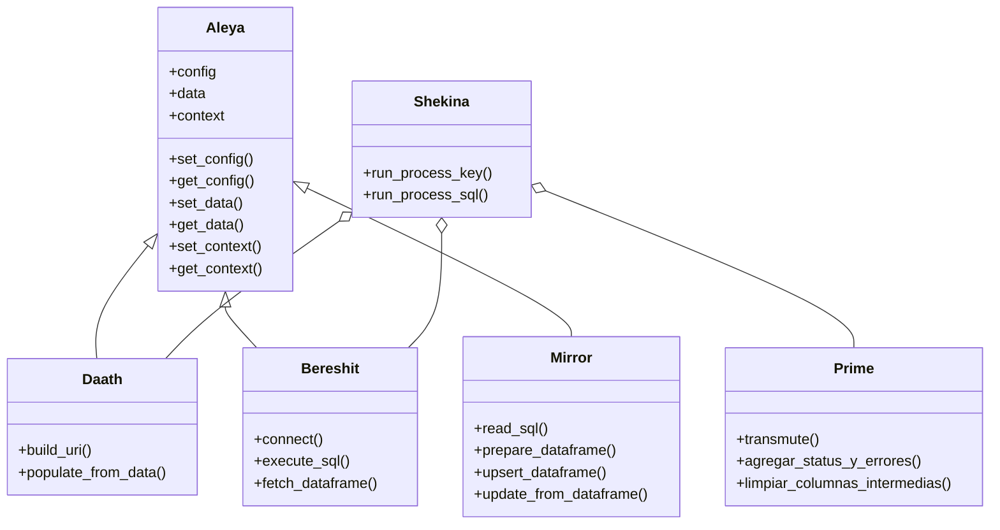
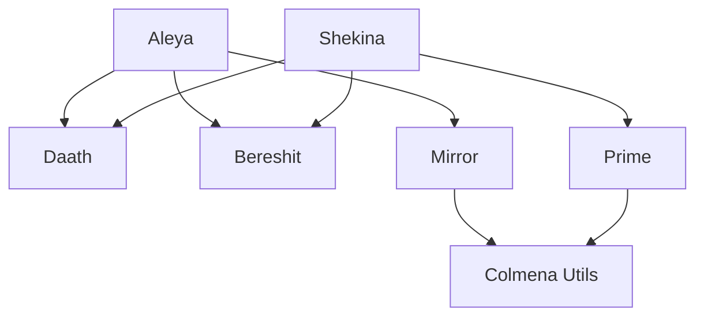

# Diagramas del Framework

## Diagrama de clases (herencia y composición)

```mermaid
classDiagram
    class Aleya {
        +config
        +data
        +context
        +set_config()
        +get_config()
        +set_data()
        +get_data()
        +set_context()
        +get_context()
    }
    class Daath {
        +build_uri()
        +populate_from_data()
    }
    class Bereshit {
        +connect()
        +execute_sql()
        +fetch_dataframe()
    }
    class Mirror {
        +read_sql()
        +prepare_dataframe()
        +upsert_dataframe()
        +update_from_dataframe()
    }
    class Prime {
        +transmute()
        +agregar_status_y_errores()
        +limpiar_columnas_intermedias()
    }
    class Shekina {
        +run_process_key()
        +run_process_sql()
    }

    Aleya <|-- Daath
    Aleya <|-- Bereshit
    Aleya <|-- Mirror
    Shekina o-- Daath
    Shekina o-- Bereshit
    Shekina o-- Prime
```

## Diagrama de relaciones

```mermaid
graph TD
    Aleya --> Daath
    Aleya --> Bereshit
    Aleya --> Mirror
    Shekina --> Daath
    Shekina --> Bereshit
    Shekina --> Prime
    Mirror --> Colmena[Colmena Utils]
    Prime --> Colmena
```
