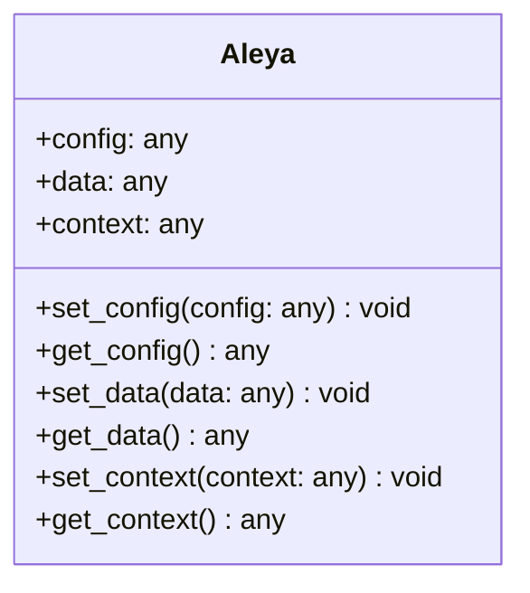
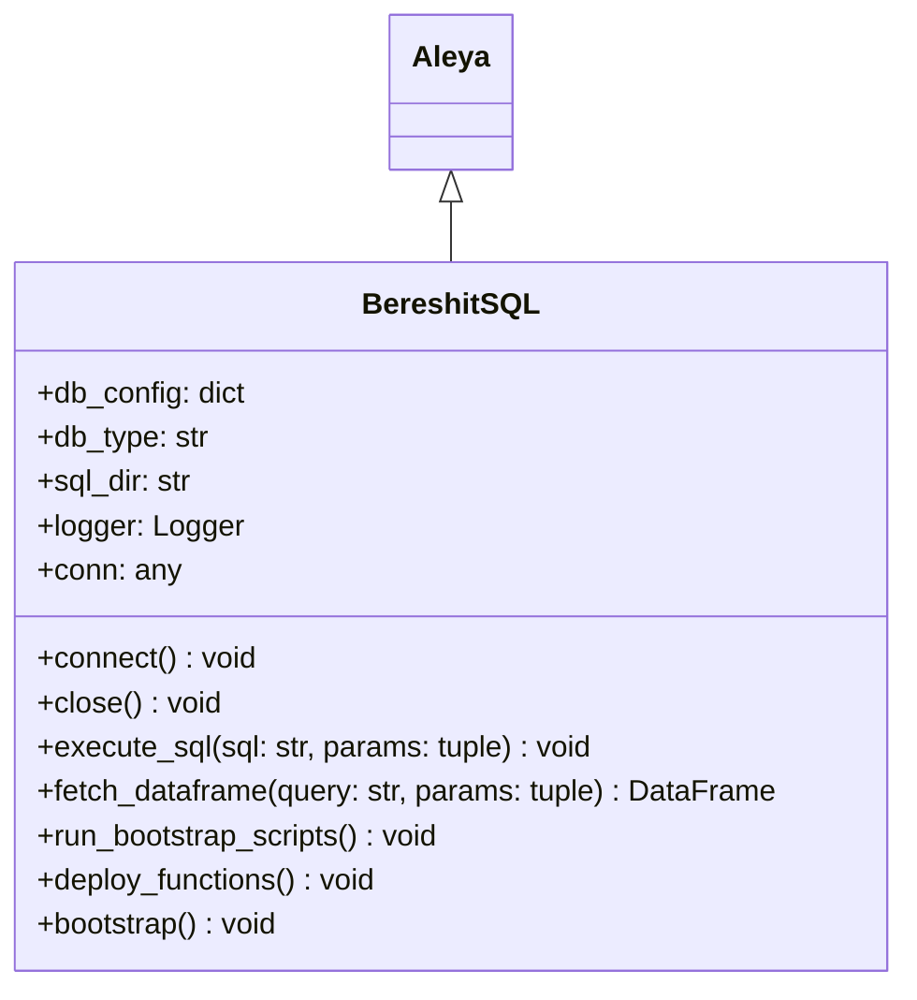
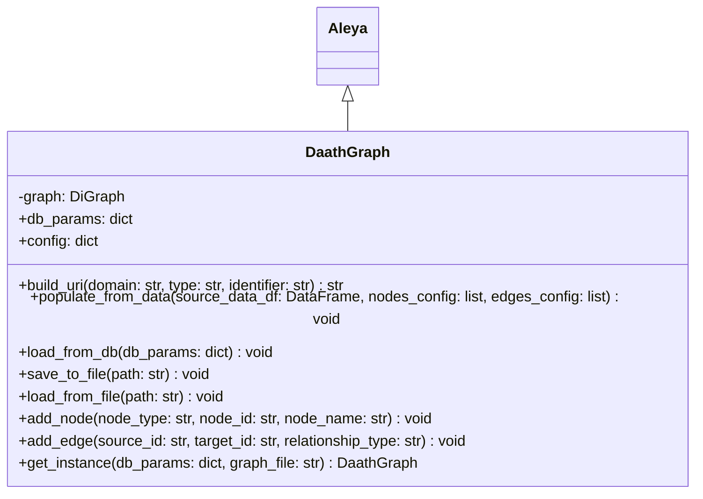
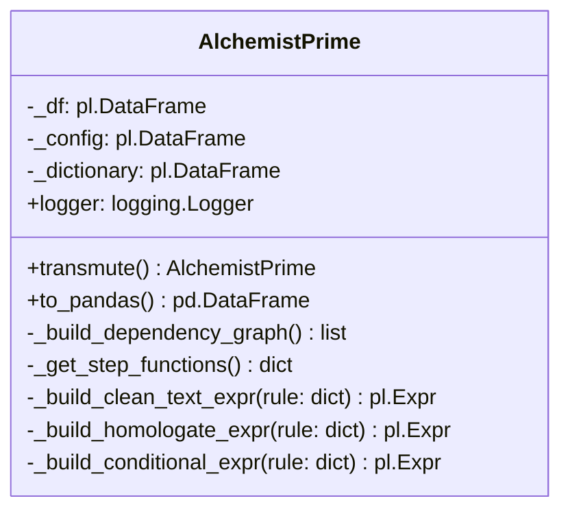
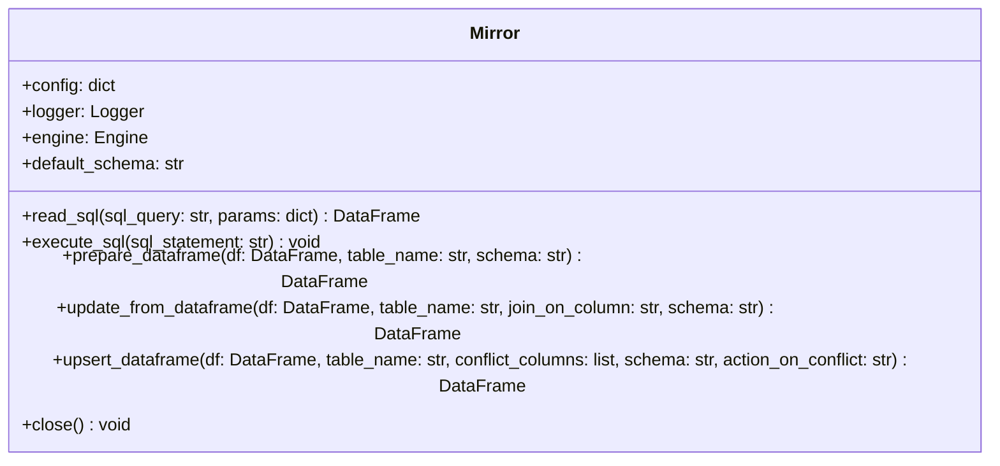
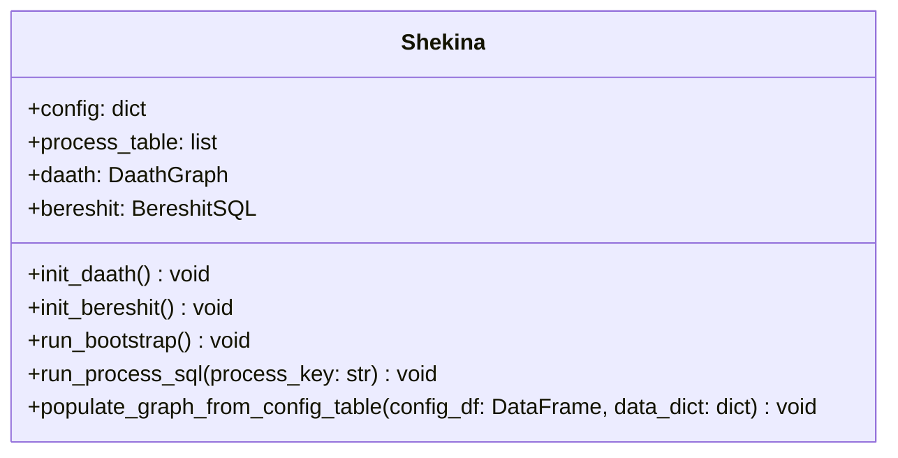

# Documentación de Clases

En esta sección, se documentan las clases principales del sistema, detallando su arquitectura, métodos y ejemplos de uso.

## Prompt para Generación de Documentación

A continuación se presenta el prompt utilizado para generar la documentación de las clases con un modelo de lenguaje avanzado. Este prompt está diseñado para asegurar consistencia y calidad en la documentación generada.

```markdown
Genera la documentación para las siguientes clases de Python en formato Markdown, para ser usada en Docusaurus. Para cada clase, por favor incluye:

1.  **Nombre de la Clase y Descripción Breve:** Un título con el nombre de la clase y un párrafo que resuma su propósito principal.
2.  **Diagrama de Clases (Mermaid):** Un diagrama de clases en formato Mermaid que muestre:
    *   La clase principal.
    *   Sus atributos (propiedades).
    *   Sus métodos (funciones).
    *   Cualquier relación de herencia (si aplica).
3.  **Atributos:** Una sección que describa los atributos más importantes de la clase.
4.  **Métodos Principales:** Una sección que describa los métodos más importantes, explicando qué hace cada uno, sus parámetros y qué retorna.
5.  **Ejemplo de Uso:** Un bloque de código en Python mostrando un ejemplo simple de cómo instanciar y usar la clase.

**Clases a Documentar:**

*   `AlchemistPrime`
*   `Aleya`
*   `BereshitSQL`
*   `DaathGraph`
*   `Mirror`
*   `Shekina`

**Mejores Prácticas para Mermaid:**

*   Usa `classDiagram` para iniciar el diagrama.
*   Define la clase con `class NombreClase { ... }`.
*   Define atributos con `+tipo atributo`.
*   Define métodos con `+metodo(params) tipo_retorno`.
*   Usa `<|--` para indicar herencia.
```

## Clases del Sistema

A continuación, se presenta la documentación generada para cada una de las clases principales.

### Aleya

`Aleya` es una clase base genérica diseñada para la gestión de contextos dentro de frameworks de datos y grafos. Su propósito es estandarizar la forma en que se manejan configuraciones, DataFrames y otros objetos complejos a través de diferentes componentes del sistema.

#### Diagrama de Clases (Mermaid)



#### Atributos

*   `config`: Almacena cualquier tipo de objeto de configuración (ej. un diccionario con parámetros de conexión).
*   `data`: Almacena los datos principales a ser procesados (ej. un DataFrame de Pandas).
*   `context`: Almacena un objeto de contexto más amplio o complejo (ej. un objeto de grafo de NetworkX).

#### Métodos Principales

*   `set_config(config)`: Establece el objeto de configuración.
*   `get_config()`: Retorna el objeto de configuración actual.
*   `set_data(data)`: Establece el objeto de datos.
*   `get_data()`: Retorna el objeto de datos actual.
*   `set_context(context)`: Establece el objeto de contexto.
*   `get_context()`: Retorna el objeto de contexto actual.

#### Ejemplo de Uso

```python
from src.aleya.aleya import Aleya
import pandas as pd

# Crear una instancia de Aleya
gestor_contexto = Aleya()

# Configurar un diccionario
db_config = {'host': 'localhost', 'user': 'admin'}
gestor_contexto.set_config(db_config)

# Establecer un DataFrame de Pandas como datos
datos = pd.DataFrame({'col1': [1, 2], 'col2': [3, 4]})
gestor_contexto.set_data(datos)

# Usar los métodos get para recuperar la información
config_actual = gestor_contexto.get_config()
datos_actuales = gestor_contexto.get_data()

print("Configuración:", config_actual)
print("Datos:", datos_actuales)
```

### BereshitSQL

`BereshitSQL` es una clase especializada que hereda de `Aleya` y está diseñada para la gestión y normalización de bases de datos, con un enfoque en PostgreSQL. Facilita la conexión, ejecución de scripts SQL y la inicialización de entornos de base de datos (bootstrap).

#### Diagrama de Clases (Mermaid)



#### Atributos

*   `db_config` (dict): Diccionario con los parámetros de conexión a la base de datos (usuario, contraseña, host, etc.).
*   `db_type` (str): El tipo de base de datos a la que se conectará (ej. 'postgresql').
*   `sql_dir` (str): Directorio donde se encuentran los scripts SQL a ejecutar.
*   `conn`: Objeto de conexión a la base de datos una vez que se establece.

#### Métodos Principales

*   `connect()`: Establece la conexión con la base de datos usando `db_config`.
*   `close()`: Cierra la conexión a la base de datos.
*   `execute_sql(sql, params)`: Ejecuta una sentencia SQL que no retorna resultados (como `CREATE TABLE`, `INSERT`, etc.).
*   `fetch_dataframe(query, params)`: Ejecuta una consulta SQL (`SELECT`) y devuelve los resultados en un DataFrame de Pandas.
*   `bootstrap()`: Orquesta el proceso completo de inicialización, conectándose, desplegando funciones y cerrando la conexión.
*   `deploy_functions()`: Ejecuta los scripts SQL encontrados en `sql_dir` para crear funciones, esquemas, etc.

#### Ejemplo de Uso

```python
from src.bereshit.bereshit_sql import BereshitSQL

# Configuración de la base de datos
db_config = {
    "host": "localhost",
    "database": "mi_db",
    "user": "mi_usuario",
    "password": "mi_password"
}

# Directorio con scripts SQL para inicialización
sql_path = "ruta/a/mis/scripts"

# Crear una instancia de BereshitSQL
bsql = BereshitSQL(db_config=db_config, sql_dir=sql_path)

# Ejecutar el proceso de bootstrap para inicializar la BD
bsql.bootstrap()

# Conectar y realizar una consulta
bsql.connect()
df_usuarios = bsql.fetch_dataframe("SELECT * FROM usuarios")
print(df_usuarios)
bsql.close()
```

### DaathGraph

`DaathGraph` es una clase que implementa el patrón Singleton y hereda de `Aleya`. Su función es centralizar la gestión de un grafo de conocimiento, permitiendo poblarlo desde diversas fuentes de datos (como DataFrames o bases de datos), consultarlo y manipular su estructura de nodos y aristas.

#### Diagrama de Clases (Mermaid)



#### Atributos

*   `graph` (networkx.DiGraph): El objeto de grafo dirigido que almacena los nodos y aristas del conocimiento.
*   `db_params` (dict): Parámetros de conexión a la base de datos para cargar o persistir el grafo.
*   `config` (dict): Configuración general para el comportamiento de la clase.

#### Métodos Principales

*   `get_instance(db_params, graph_file)`: Método de clase que devuelve la única instancia del grafo (patrón Singleton).
*   `populate_from_data(source_data_df, nodes_config, edges_config)`: Puebla el grafo a partir de un DataFrame de Pandas y una configuración que mapea las columnas a nodos y aristas.
*   `load_from_db(db_params)`: Carga la estructura del grafo desde una base de datos PostgreSQL.
*   `save_to_file(path)` / `load_from_file(path)`: Serializa o deserializa el grafo a/desde un archivo.
*   `add_node(node_type, node_id, node_name)`: Añade un nodo al grafo con su tipo, ID y nombre.
*   `add_edge(source_id, target_id, relationship_type)`: Crea una relación (arista) entre dos nodos.

#### Ejemplo de Uso

```python
import pandas as pd
from src.daath.daath_graph import DaathGraph

# Obtener la instancia única del grafo
grafo_conocimiento = DaathGraph.get_instance()

# Datos de ejemplo
datos = pd.DataFrame({
    'id_paciente': [101, 102],
    'nombre_paciente': ['Juan Perez', 'Ana Gomez'],
    'id_diagnostico': ['D01', 'D02'],
    'nombre_diagnostico': ['Diabetes', 'Hipertensión']
})

# Configuración para poblar el grafo
nodes_cfg = [
    {'type': 'Paciente', 'id_field': 'id_paciente', 'name_field': 'nombre_paciente'},
    {'type': 'Diagnostico', 'id_field': 'id_diagnostico', 'name_field': 'nombre_diagnostico'}
]
edges_cfg = [
    {'source': 'id_paciente', 'source_type': 'Paciente', 'target': 'id_diagnostico', 'target_type': 'Diagnostico', 'relationship': 'TIENE_DIAGNOSTICO'}
]

# Poblar el grafo desde el DataFrame
grafo_conocimiento.populate_from_data(datos, nodes_cfg, edges_cfg)

# Imprimir información del grafo
print(f"Nodos: {grafo_conocimiento.graph.number_of_nodes()}")
print(f"Aristas: {grafo_conocimiento.graph.number_of_edges()}")
```

### AlchemistPrime

`AlchemistPrime` es un motor de ETL (Extracción, Transformación y Carga) declarativo y avanzado. Su diseño se centra en la ejecución de pipelines de transformación de datos definidos en una configuración, optimizando el rendimiento mediante el procesamiento por lotes basado en un grafo de dependencias (DAG).

#### Diagrama de Clases (Mermaid)



#### Atributos

*   `_df` (polars.DataFrame): El DataFrame interno (en formato Polars) que se va transformando.
*   `_config` (polars.DataFrame): La configuración del pipeline, donde cada fila es un paso de transformación.
*   `_dictionary` (polars.DataFrame): Un diccionario de datos para operaciones de homologación.

#### Métodos Principales

*   `transmute()`: Orquesta y ejecuta el pipeline completo. Analiza las dependencias entre los pasos, los agrupa en lotes y los ejecuta en orden, garantizando que una transformación no se ejecute hasta que sus dependencias estén resueltas.
*   `to_pandas()`: Convierte el DataFrame interno de Polars a un DataFrame de Pandas, usualmente al final del proceso.
*   `_get_step_functions()`: Un método interno que actúa como una fábrica, mapeando los tipos de pasos definidos en la configuración (ej. "CLEAN_TEXTO_NLP") a los métodos que construyen la expresión de Polars correspondiente.
*   `_build_..._expr(rule)`: Conjunto de métodos privados, cada uno responsable de construir una expresión de Polars para un tipo de transformación específico (limpieza de texto, homologación, etc.).

#### Ejemplo de Uso

```python
import pandas as pd
from src.alchemist.alchemist_prime import AlchemistPrime

# 1. Datos de entrada
data = pd.DataFrame({'nombres': ['  JOSÉ PÉREZ ', 'María  García '], 'estado_civil': ['soltero', 'casada']})

# 2. Configuración del pipeline
config = pd.DataFrame({
    'step_id': [1, 2],
    'step_type': ['CLEAN_TEXTO_NLP', 'HOMOLOGATE'],
    'source_column': ['nombres', 'estado_civil'],
    'target_column': ['nombre_limpio', 'estado_civil_homologado'],
    'step_params': ['{}', '{"dictionary_key": "estado_civil"}']
})

# 3. Diccionario para homologar
dictionary = pd.DataFrame({
    'concepto_normal': ['estado_civil', 'estado_civil'],
    'valor_normal': ['soltero', 'casada'],
    'es_sinonimo_de': ['SOLTERO/A', 'CASADO/A']
})

# Instanciar y ejecutar el motor ETL
alchemist = AlchemistPrime(data_df=data, config_df=config, dictionary_df=dictionary)

# Ejecutar las transformaciones
df_resultado = alchemist.transmute().to_pandas()

print(df_resultado)
```

### Mirror

`Mirror` es una clase robusta para la gestión de conexiones y operaciones con bases de datos. Abstrae la complejidad de interactuar con diferentes sistemas de bases de datos (PostgreSQL, MSSQL, MySQL) a través de una interfaz unificada, utilizando SQLAlchemy como motor.

#### Diagrama de Clases (Mermaid)



#### Atributos

*   `config` (dict): Diccionario de configuración con todos los detalles de la conexión (tipo de BD, host, usuario, contraseña, etc.).
*   `engine` (sqlalchemy.engine.Engine): El motor de SQLAlchemy que gestiona el pool de conexiones.
*   `logger`: Un objeto de logging para registrar todas las operaciones.

#### Métodos Principales

*   `read_sql(sql_query, params)`: Ejecuta una consulta `SELECT` y devuelve los resultados en un DataFrame de Pandas.
*   `execute_sql(sql_statement)`: Ejecuta sentencias que no devuelven datos, como `TRUNCATE`, `UPDATE` o DDL.
*   `prepare_dataframe(df, table_name, schema)`: Alinea un DataFrame con la estructura de una tabla de destino (ordena columnas, elimina las sobrantes, etc.).
*   `update_from_dataframe(df, table_name, join_on_column, schema)`: Realiza una actualización masiva de filas en una tabla a partir de los datos de un DataFrame.
*   `upsert_dataframe(df, table_name, conflict_columns, ...)`: Realiza una operación de "UPSERT" (insertar o actualizar) de alto rendimiento, ideal para sincronizar datos.
*   `close()`: Cierra el pool de conexiones del motor de SQLAlchemy.

#### Ejemplo de Uso

```python
import pandas as pd
from src.mirror.mirror import Mirror

# Configuración para una base de datos PostgreSQL
db_config = {
    "db_type": "postgresql",
    "host": "localhost",
    "port": 5432,
    "database": "ventas_db",
    "user": "reporter",
    "password": "password_seguro",
    "schema": "public"
}

# Crear una instancia de Mirror
db_mirror = Mirror(config=db_config)

# Leer datos de una tabla
try:
    df_productos = db_mirror.read_sql("SELECT * FROM productos WHERE categoria = :cat", params={'cat': 'Electrónica'})
    print("Productos de electrónica:")
    print(df_productos)

    # Preparar un DataFrame para actualizar precios
    nuevos_precios = pd.DataFrame({
        'id_producto': [101, 102],
        'precio': [999.99, 1299.00]
    })

    # Ejecutar la actualización
    resultado_update = db_mirror.update_from_dataframe(
        df=nuevos_precios,
        table_name='productos',
        join_on_column='id_producto'
    )
    print(f"Resultado de la actualización: {resultado_update.to_dict('records')}")

finally:
    # Siempre cerrar la conexión
    db_mirror.close()
```

### Shekina

`Shekina` actúa como el orquestador principal del sistema, especialmente en su integración con entornos como KNIME. Su rol es inicializar y coordinar los diferentes componentes del ecosistema (`DaathGraph`, `BereshitSQL`, `AlchemistPrime`) y ejecutar procesos complejos definidos en una tabla de configuración.

#### Diagrama de Clases (Mermaid)



#### Atributos

*   `config` (dict): La configuración global que contiene los parámetros para todos los subcomponentes.
*   `process_table` (list/DataFrame): Una tabla que define los diferentes procesos que `Shekina` puede ejecutar, incluyendo sus parámetros, scripts SQL y configuración de mapeo para el grafo.
*   `daath` (DaathGraph): La instancia del grafo de conocimiento.
*   `bereshit` (BereshitSQL): La instancia para operaciones de inicialización de la base de datos.

#### Métodos Principales

*   `init_daath()` / `init_bereshit()`: Métodos para inicializar perezosamente las instancias de `DaathGraph` y `BereshitSQL` cuando se necesitan por primera vez.
*   `run_bootstrap()`: Ejecuta el proceso de inicialización de la base de datos a través de `BereshitSQL`.
*   `run_process_sql(process_key)`: Busca un proceso en la `process_table` por su clave, ejecuta la consulta SQL asociada usando `BereshitSQL`, y si obtiene resultados, los usa para poblar el grafo `DaathGraph`.
*   `populate_graph_from_config_table(config_df, data_dict)`: Un método más genérico para poblar el grafo, iterando sobre una tabla de configuración y un diccionario de DataFrames.

#### Ejemplo de Uso

```python
from src.shekina.shekina import Shekina
import pandas as pd

# Configuración global del sistema
master_config = {
    'db_params': {
        "host": "localhost", "database": "knowledge_db", "user": "admin", "password": "pw"
    },
    'sql_dir': 'path/to/sql'
}

# Tabla de procesos (simulada como una lista de dicts)
process_table = [
    {
        'process_key': 'cargar_pacientes',
        'execute': True,
        'source_query': 'SELECT id, nombre, fecha_nac FROM stg.pacientes;',
        'nodes_config': [{'type': 'Paciente', 'id_field': 'id', 'name_field': 'nombre'}],
        'edges_config': []
    }
]

# Instanciar el orquestador
orquestador = Shekina(config=master_config, process_table=process_table)

# Inicializar la base de datos (ejecutaría los scripts en 'sql_dir')
# orquestador.run_bootstrap()

# Ejecutar un proceso específico por su clave
# Esto conectaría a la BD, ejecutaría el SELECT y poblaría el grafo con los resultados.
# Para que funcione, se necesita una BD corriendo y accesible.
# orquestador.run_process_sql('cargar_pacientes')

# Acceder a los componentes subyacentes
# orquestador.init_daath()
# print(f"Nodos en el grafo: {orquestador.daath.graph.number_of_nodes()}")
```
