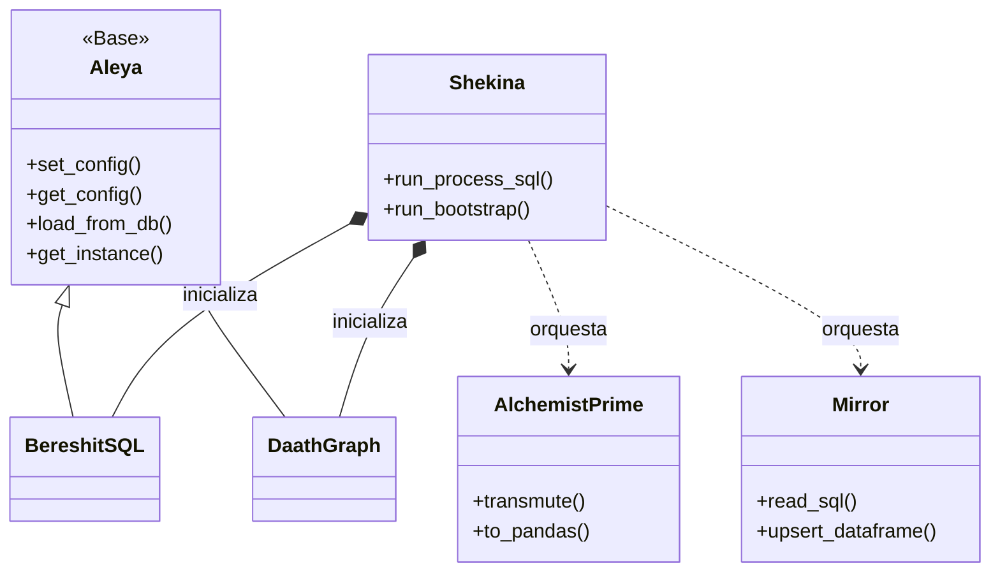

import AttachMermaidLinks from '@site/src/components/AttachMermaidLinks';

Esta sección detalla la arquitectura y el diseño técnico del ecosistema de Shekina.

## Diagrama de relaciones de clases

El siguiente diagrama ilustra las relaciones entre las clases principales del sistema.

## Componentes principales

| Componente        | Descripción                                                                 | Enlace a documentación |
|-------------------|-----------------------------------------------------------------------------|------------------------|
| **Shekina**       | Orquestador central que inicializa y coordina los demás componentes.         | [Ver detalles](Shekina/index.md) |
| **Aleya**         | Clase base para gestión de datos y configuraciones.                          | [Ver detalles](Aleya/index.md) |
| **BereshitSQL**   | Inicialización y gestión de bases de datos, ejecutando scripts SQL.          | [Ver detalles](BereshitSQL/index.md) |
| **DaathGraph**    | Gestión del grafo de conocimiento, creación y consulta de nodos/aristas.     | [Ver detalles](DaathGraph/index.md) |
| **AlchemistPrime**| Motor ETL para transformación y limpieza de datos basada en pipelines.       | [Ver detalles](AlchemistPrime/index.md) |
| **Mirror**        | API robusta para interactuar con múltiples bases de datos.                   | [Ver detalles](Mirror/index.md) |

Cada enlace lleva a la especificación, ejemplos de uso y versionado de la clase correspondiente.
