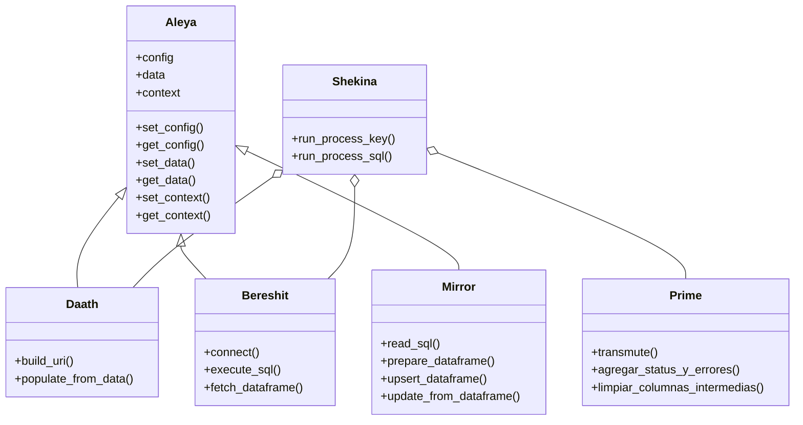

# Jerarquía de Clases

Esta sección documenta la jerarquía y relaciones entre las clases principales del framework Shekina.

## Diagrama de herencia y composición

## Descripción de la jerarquía
- `Aleya`: Clase base para configuración y contexto.
- `Daath`, `Bereshit`, `Mirror`: Heredan de Aleya, especializadas en grafo, persistencia y manipulación de datos.
- `Prime`: Procesos avanzados y utilidades.
- `Shekina`: Orquestador principal, compone y coordina las clases especializadas.

---

La validación progresiva se realizará siguiendo las épicas definidas.