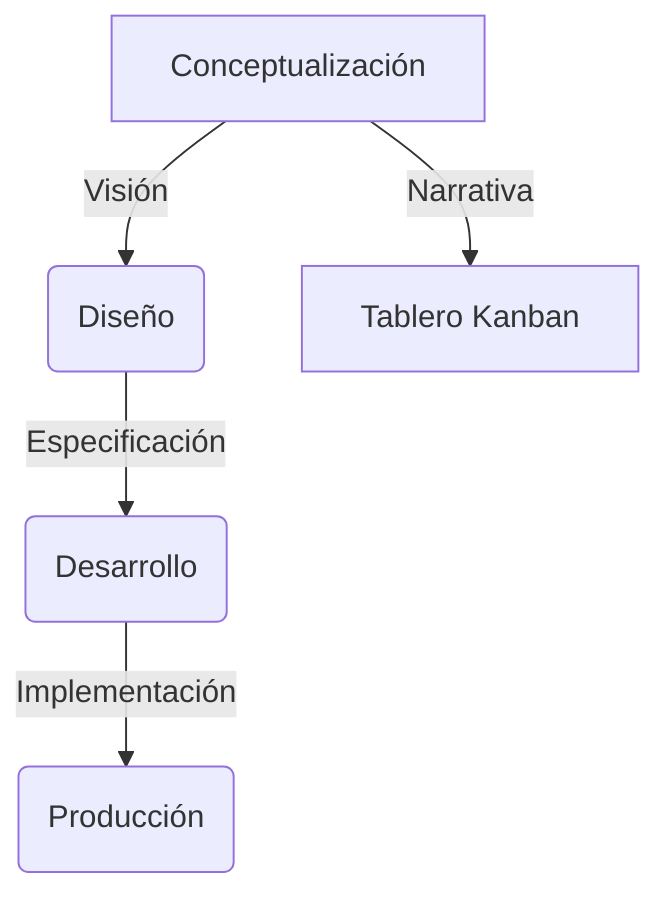

# Prompts Ágiles

Plantillas y ejemplos de prompts para generación y depuración de código, documentación y pruebas.

---
title: Mapa Mental del Framework Shekina
description: Visualización raíz y tablero Kanban del proyecto
---

# Mapa Mental del Framework Shekina

Este es el punto de partida para navegar y entender la estructura, el avance y la gestión del proyecto Shekina.

## Visualización Interactiva

## Tablero Kanban del Proyecto

[Ir al tablero Kanban en GitHub Projects](https://github.com/tu_usuario/shekina_health/projects)

---

> Usa este mapa mental para navegar entre los aspectos clave del framework y consultar el estado de avance en el tablero Kanban.
