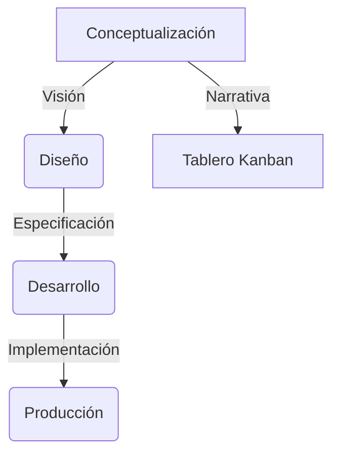

# Prompts Ágiles
---
title: Mapa mental del framework
description: Punto de partida para navegar la documentación y el tablero del proyecto
sidebar_position: 0
---

# Mapa mental del framework Shekina

Este es el punto de partida para navegar y entender la estructura, el avance y la gestión del proyecto Shekina.

## Visión general

- Concepto: consulta [Concepto](concepto/index).
- Diseño: consulta [Diseño](dise%C3%B1o/index).
- Formación: consulta [Formación](formacion/index).
- Nacimiento: consulta [Nacimiento](nacimiento/index).

## Tablero Kanban del proyecto

[Ir al tablero Kanban en GitHub Projects](https://github.com/tu_usuario/shekina_health/projects)

