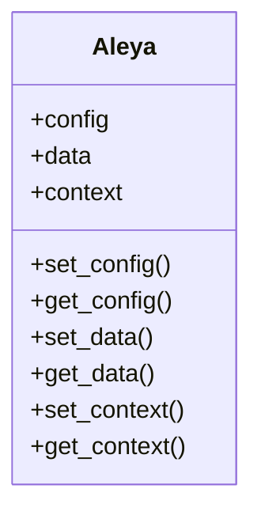

# Aleya

## Descripción
Clase base genérica para gestión de contextos en frameworks de datos y grafos. Permite manejar múltiples configuraciones, DataFrames y objetos complejos.

---

## Diagrama de clase


---

## Ejemplo de uso
```python
alc = Aleya()
alc.set_config({'db': 'postgresql'})
alc.set_data(my_dataframe)
alc.set_context(my_context)
```

## Métodos principales
- `set_config(config)`: Establece la configuración.
- `get_config()`: Obtiene la configuración.
- `set_data(data)`: Establece los datos tabulares.
- `get_data()`: Obtiene los datos tabulares.
- `set_context(context)`: Establece el contexto (grafo, conexión, etc.).
- `get_context()`: Obtiene el contexto.

---

## Versiones y cambios
Ver `src/aleya/CHANGELOG_Aleya.md` para el historial de cambios.
