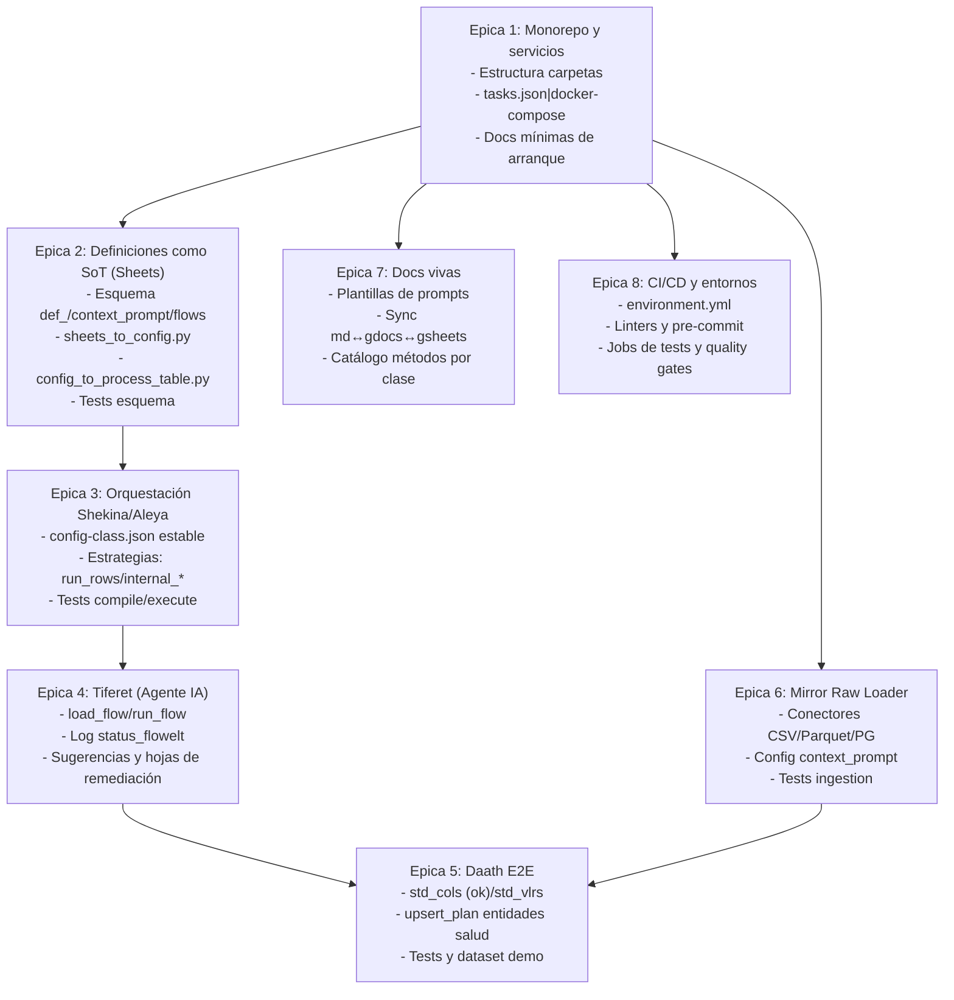

# Plan Shekina: orquestación, definiciones y automatización IA

Este documento captura el plan acordado para reorganizar el framework, centralizar definiciones en Google Sheets/Docs y automatizar la ejecución de flujos con una nueva clase Tiferet. Sirve como prompt operativo para retomar trabajo.

## Prompt base (resumen de intención)

- Reorganizar el framework con carpetas: data, definitions (Google Drive), services/docker, services/docusaurus, services/notebooks, src/<clases>, tests/<clases>.
- Definir hojas Google Sheets:
  - hoja1: def_ (columnas: nombre_clases; filas: métodos).
  - hoja2: context_prompt (json_root | atributo | valor) incluyendo config-ia, referencias y contexto.
  - hojas 3..n: flowelt_raw_loader, flowelt__daath_std_cols, flowelt__daath_std_vlrs, flowelt__upsert_daath_health, flowelt__create_ripsJson.
- Generar automáticamente JSON y process_table desde Sheets.
- Implementar clase Tiferet: leer flujo, activar agente IA, ejecutar con Shekina, y registrar status_flowelt | msg_flowelt; si faltan sinónimos/valores, crear nuevas hojas de remediación.
- Gestionar credenciales Google (cuenta de servicio) y configuración del workspace.
- BackendGSuite en Mirror para Drive/Sheets/Docs y utilidades de formateo MD ↔ GDoc ↔ GSheet.

## Épicas y entregables

## Sprints iniciales

- Sprint 1: esquema Sheets + conversores + Tiferet esqueleto + docs de contratos. Aceptación: Sheet ejemplo → JSON + process_table → Shekina (dry-run) con log.
- Sprint 2: internal_daath valores + Tiferet crea hojas std_* al fallar + Mirror estable + prompts en docs. Aceptación: flujo raw→std_cols→std_vlrs→upsert_plan con logs y remediación.

## Decisiones de configuración (credenciales)

- No versionar credenciales. Usar GOOGLE_APPLICATION_CREDENTIALS apuntando a .secrets/google-service-account.json.
- Archivo de configuración del workspace en config/google_workspace.json (ignorado en git). Proveer config/google_workspace.example.json como plantilla.
